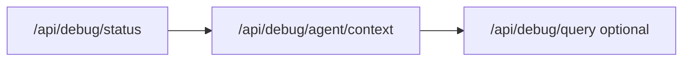

# Local debug API (dev only)

Query in-memory debug buffers on `http://localhost:3000/api/debug/*` while `npm run dev` or `npm run dev:full` is running. **Not available when `NODE_ENV=production`.** For prod/staging use `@.cursor/skills/axiom-mcp/SKILL.md`.

Skill: `@.cursor/skills/local-dev/SKILL.md` for npm and Windows shell.

## Agent workflow (recommended)

1. **Pick dataset** — local dev only (`localhost:3000`).
2. **Snapshot** — `GET /api/debug/status` (buffer counts, last error, recent `jobId`s).
3. **Get identifier** — from user, API response, or status:
   - Sync translate → `traceId` in response JSON
   - Async batch → `jobId` in `202` response (`trl_*` / `ana_*`)
   - HTTP issue → `X-Request-Id` header
4. **One-shot context** — `GET /api/debug/agent/context?jobId=...` (preferred for async jobs).
5. **Drill down** — `GET /api/debug/query?kind=prompts&jobId=...` if prompts needed separately.
6. **Catalog** — `GET /api/debug/catalog` for event names and example queries.



## Sync vs async

| Mode            | Trigger                               | Agent entry point                                             |
| --------------- | ------------------------------------- | ------------------------------------------------------------- |
| Sync translate  | Default single/batch (no `?async=1`)  | `agent/context?traceId=...` from response                     |
| Async translate | `?async=1` or `Prefer: respond-async` | **`agent/context?jobId=trl_...`** (one `traceId` per chapter) |
| Async analysis  | `?async=1` on analyze-batch           | `agent/context?jobId=ana_...`                                 |

**Important:** For async translate jobs, always start with `jobId`, not `kind=trace&jobId=`.

## Prerequisites

1. API running: `npm run dev` or `npm run dev:full`
2. Async jobs + worker data in API buffer: `REDIS_URL` + `dev:full`
3. Recommended in `.env`:
   - `DEBUG_CAPTURE_LLM=1`
   - `DEBUG_CAPTURE_HTTP=1`
4. Optional persistence: `DEBUG_PERSIST=1`, `DEBUG_PERSIST_HYDRATE=1`
5. Worker bridge backlog: `DEBUG_BRIDGE_BACKLOG=500` (default)

## Primary endpoints

| Endpoint                       | Use                                            |
| ------------------------------ | ---------------------------------------------- |
| `GET /api/debug/status`        | First call — counts, last error, recent jobs   |
| `GET /api/debug/agent/context` | **Main** — markdown + code hints + summary     |
| `GET /api/debug/query`         | Filtered JSON (`format=agent` same as context) |
| `GET /api/debug/catalog`       | Translation events + example queries           |
| `GET /api/debug/jobs/:jobId`   | JSON aggregate (legacy/detailed)               |

### Agent context query params

| Param                               | Description                       |
| ----------------------------------- | --------------------------------- |
| `jobId` \| `traceId` \| `requestId` | One required (mutually exclusive) |
| `includePrompts`                    | default `1`                       |
| `includeHttp`                       | default `1`                       |
| `limit`                             | max log lines (default 500)       |

### Query API params

| Param        | Values                                      |
| ------------ | ------------------------------------------- |
| `kind`       | `logs`, `http`, `prompts`, `trace`, `all`   |
| `format`     | `json` (default), `agent`                   |
| `sort`       | `asc` (timeline), `desc` (default for JSON) |
| `compact`    | `1` — omit `*Preview` fields                |
| `errorsOnly` | `1`                                         |
| `limit`      | default 50, max 500                         |

## Curl recipes

```bash
# 1. Snapshot
curl -s "http://localhost:3000/api/debug/status"

# 2. Full async job context (markdown for agent)
curl -s "http://localhost:3000/api/debug/agent/context?jobId=trl_REPLACE_ME&includePrompts=1"

# 3. Sync trace
curl -s "http://localhost:3000/api/debug/agent/context?traceId=UUID"

# 4. Errors only (JSON)
curl -s "http://localhost:3000/api/debug/query?kind=all&errorsOnly=1&limit=30&compact=1"

# 5. Event catalog
curl -s "http://localhost:3000/api/debug/catalog"

# 6. Pipeline stage filter
curl -s "http://localhost:3000/api/debug/query?kind=logs&event=pipeline.stage.failed&sort=asc"
```

## Correlation IDs

| ID          | Where to get it                                                      |
| ----------- | -------------------------------------------------------------------- |
| `requestId` | Response header `X-Request-Id`                                       |
| `traceId`   | Sync translate response `{ traceId }`; async worker: one per chapter |
| `jobId`     | Async `202` response `{ jobId }` (`ana_*` / `trl_*`)                 |

## UI vs API

| Need                         | Tool                                    |
| ---------------------------- | --------------------------------------- |
| Waterfall, manual copy       | `http://localhost:5174/debug/`          |
| Agent / chat automated fetch | `/api/debug/agent/context` (this skill) |
| Prod incident                | Axiom MCP                               |

## Legacy endpoints (still supported)

- `GET /api/debug/logs`, `/traces`, `/traces/:id`, `/export`, `/prompts`, `/http`
- `POST /api/debug/clear`, `/clear-http`, `/clear-prompts`

See `@docs/02-how-to/debug-translation.md` and `@.cursor/rules/debug.mdc`.
