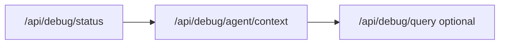

# Local debug API (dev only)

Query in-memory debug buffers on `http://localhost:3000/api/debug/*` while `npm run dev` or `npm run dev:full` is running. **Not available when `NODE_ENV=production`.** For prod/staging use `@.cursor/skills/axiom-mcp/SKILL.md`.

Skill: `@.cursor/skills/local-dev/SKILL.md` for npm and Windows shell.

## Agent workflow (recommended)

1. **Pick dataset** — local dev only (`localhost:3000`).
2. **Snapshot** — `GET /api/debug/status` (buffer counts, last error, recent `jobId`s).
3. **Get identifier** — from user, API response, or status:
   - **One chapter** (sync or async) → `traceId` from `translation.completed` log
   - Async **whole batch** → `jobId` in `202` response (`trl_*` / `ana_*`)
   - HTTP issue → `X-Request-Id` header
4. **One-shot context** — `GET /api/debug/agent/context?traceId=...` (one chapter) or `?jobId=...` (full batch; add `&detail=1` for per-trace sections).
5. **Drill down** — `GET /api/debug/query?kind=prompts&traceId=...` if prompts needed separately.
6. **Catalog** — `GET /api/debug/catalog` for event names and example queries.



## Sync vs async

| Mode            | Trigger                               | Agent entry point                                            |
| --------------- | ------------------------------------- | ------------------------------------------------------------ |
| Sync translate  | Default single/batch (no `?async=1`)  | `agent/context?traceId=...` from response                    |
| Async translate | `?async=1` or `Prefer: respond-async` | **One chapter:** `traceId`; **whole batch:** `jobId=trl_...` |
| Async analysis  | `?async=1` on analyze-batch           | `agent/context?jobId=ana_...`                                |

**Important:** `jobId` returns logs for **all chapters** in the batch. For a single chapter from async job, use `traceId`.

## Prerequisites

1. API running: `npm run dev` or `npm run dev:full`
2. Async jobs + worker data in API buffer: `REDIS_URL` + `dev:full`
3. Recommended in `.env`:
   - `DEBUG_CAPTURE_LLM=1`
   - `DEBUG_CAPTURE_HTTP=1`
4. Optional persistence: `DEBUG_PERSIST=1`, `DEBUG_PERSIST_HYDRATE=1`
5. Worker bridge backlog: `DEBUG_BRIDGE_BACKLOG=500` (default)

## Primary endpoints

| Endpoint                       | Use                                                  |
| ------------------------------ | ---------------------------------------------------- |
| `GET /api/debug/status`        | First call — counts, `window` (last 2h), recent jobs |
| `GET /api/debug/agent/context` | **Main** — markdown + code hints + summary           |
| `GET /api/debug/query`         | Filtered JSON (`format=agent` same as context)       |
| `GET /api/debug/catalog`       | Translation events + example queries                 |
| `GET /api/debug/jobs/:jobId`   | JSON aggregate (legacy/detailed)                     |

### Agent context query params

| Param                               | Description                                                                     |
| ----------------------------------- | ------------------------------------------------------------------------------- |
| `jobId` \| `traceId` \| `requestId` | One required (mutually exclusive)                                               |
| `includePrompts`                    | default `1`                                                                     |
| `includeHttp`                       | default `1`                                                                     |
| `limit`                             | max log lines (default 500)                                                     |
| `since` / `until`                   | ISO time bounds (optional)                                                      |
| `last`                              | relative window: `30m`, `1h`, `2h` (optional; no default on correlated queries) |
| `detail`                            | `1` — per-trace sections for multi-chapter `jobId` (default off)                |

### Query API params

| Param        | Values                                                |
| ------------ | ----------------------------------------------------- |
| `kind`       | `logs`, `http`, `prompts`, `trace`, `all`             |
| `format`     | `json` (default), `agent`                             |
| `sort`       | `asc` (timeline), `desc` (default for JSON)           |
| `last`       | `30m`, `1h`, `2h` (default for unscoped), `6h`, `24h` |
| `since`      | ISO lower bound (overrides default window)            |
| `until`      | ISO upper bound                                       |
| `compact`    | `1` — omit `*Preview` fields                          |
| `dedupe`     | `0` to disable fingerprint dedupe (default on)        |
| `errorsOnly` | `1`                                                   |
| `limit`      | default 50, max 500                                   |

## Curl recipes

```bash
# 1. Snapshot
curl -s "http://localhost:3000/api/debug/status"

# 2. Single chapter (preferred for one chapter in async batch)
curl -s "http://localhost:3000/api/debug/agent/context?traceId=UUID&includePrompts=0"

# 3. Full async job (all chapters in batch)
curl -s "http://localhost:3000/api/debug/agent/context?jobId=trl_REPLACE_ME&includePrompts=1"

# 4. Recent logs (default last 2h when no jobId/traceId)
curl -s "http://localhost:3000/api/debug/query?kind=logs&last=2h&compact=1&limit=100"

# 5. Errors only (JSON)
curl -s "http://localhost:3000/api/debug/query?kind=all&errorsOnly=1&limit=30&compact=1"

# 6. Event catalog
curl -s "http://localhost:3000/api/debug/catalog"

# 7. Pipeline stage filter
curl -s "http://localhost:3000/api/debug/query?kind=logs&event=pipeline.stage.failed&sort=asc&last=2h"
```

## Correlation IDs

| ID          | Where to get it                                                      |
| ----------- | -------------------------------------------------------------------- |
| `requestId` | Response header `X-Request-Id`                                       |
| `traceId`   | Sync translate response `{ traceId }`; async worker: one per chapter |
| `jobId`     | Async `202` response `{ jobId }` (`ana_*` / `trl_*`)                 |

## UI vs API

| Need                         | Tool                                    |
| ---------------------------- | --------------------------------------- |
| Waterfall, manual copy       | `http://localhost:5174/debug/`          |
| Agent / chat automated fetch | `/api/debug/agent/context` (this skill) |
| Prod incident                | Axiom MCP                               |

## Legacy endpoints (still supported)

- `GET /api/debug/logs`, `/traces`, `/traces/:id`, `/export`, `/prompts`, `/http`
- `POST /api/debug/clear`, `/clear-http`, `/clear-prompts`

See `@docs/02-how-to/debug-translation.md`, `@docs/01-reference/translation-run-log.md`, and `@.cursor/rules/debug.mdc`.
