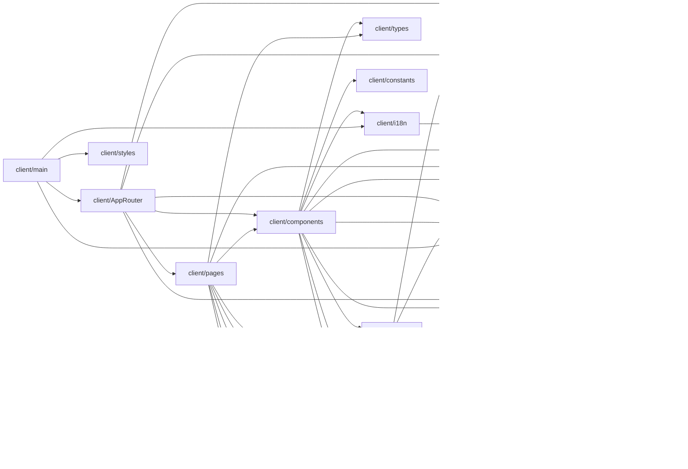
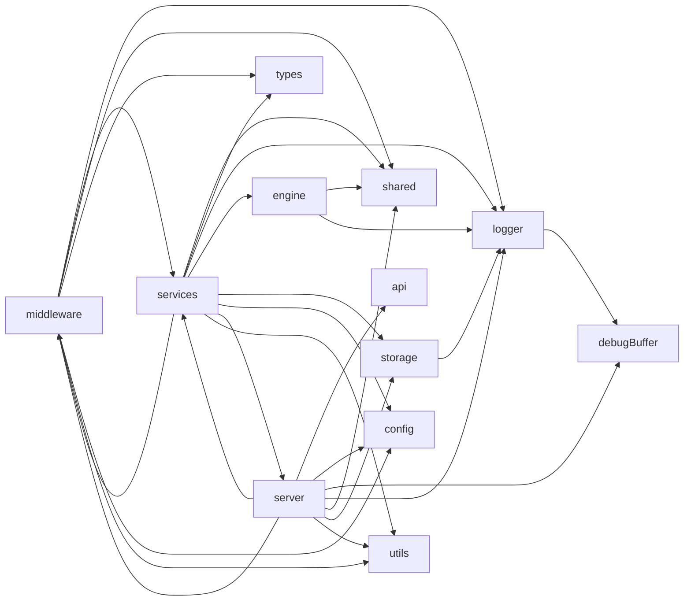

# Client module dependencies

Aggregated folder-level graph (Obsidian renders Mermaid natively).

> Auto-generated by `npm run docs:deps`.

## Client

```mermaid
flowchart LR
  src_client_AppRouter["client/AppRouter"]
  src_client_api["client/api"]
  src_client_AppRouter --> src_client_api
  src_client_components["client/components"]
  src_client_AppRouter --> src_client_components
  src_client_contexts["client/contexts"]
  src_client_AppRouter --> src_client_contexts
  src_client_pages["client/pages"]
  src_client_AppRouter --> src_client_pages
  src_client_services["client/services"]
  src_client_AppRouter --> src_client_services
  src_client_utils["client/utils"]
  src_client_AppRouter --> src_client_utils
  src_client_api --> src_client_services
  src_shared["shared"]
  src_client_api --> src_shared
  src_client_hooks["client/hooks"]
  src_client_components --> src_client_hooks
  src_client_components --> src_client_services
  src_client_components --> src_client_utils
  src_client_components --> src_shared
  src_client_components --> src_client_api
  src_client_types["client/types"]
  src_client_components --> src_client_types
  src_client_components --> src_client_contexts
  src_client_store["client/store"]
  src_client_components --> src_client_store
  src_client_i18n["client/i18n"]
  src_client_components --> src_client_i18n
  src_client_constants["client/constants"]
  src_client_components --> src_client_constants
  src_client_contexts --> src_client_utils
  src_client_contexts --> src_client_api
  src_client_contexts --> src_client_services
  src_client_hooks --> src_client_api
  src_client_hooks --> src_client_services
  src_client_hooks --> src_client_store
  src_client_hooks --> src_shared
  src_client_config["client/config"]
  src_client_hooks --> src_client_config
  src_client_hooks --> src_client_contexts
  src_client_locales["client/locales"]
  src_client_i18n --> src_client_locales
  src_client_main["client/main"]
  src_client_main --> src_client_AppRouter
  src_client_main --> src_client_contexts
  src_client_main --> src_client_i18n
  src_client_styles["client/styles"]
  src_client_main --> src_client_styles
  src_client_pages --> src_client_api
  src_client_pages --> src_client_components
  src_client_pages --> src_client_hooks
  src_client_pages --> src_client_store
  src_client_pages --> src_client_types
  src_client_pages --> src_shared
  src_client_pages --> src_client_services
  src_client_pages --> src_client_utils
  src_client_store --> src_client_api
  src_client_store --> src_shared
```

## Server overview

## Server

```mermaid
flowchart LR
  src_engine["engine"]
  src_shared["shared"]
  src_engine --> src_shared
  src_logger["logger"]
  src_engine --> src_logger
  src_debugBuffer["debugBuffer"]
  src_logger --> src_debugBuffer
  src_middleware["middleware"]
  src_middleware --> src_logger
  src_services["services"]
  src_middleware --> src_services
  src_middleware --> src_shared
  src_types["types"]
  src_middleware --> src_types
  src_config["config"]
  src_middleware --> src_config
  src_utils["utils"]
  src_middleware --> src_utils
  src_server["server"]
  src_api["api"]
  src_server --> src_api
  src_server --> src_config
  src_server --> src_debugBuffer
  src_server --> src_logger
  src_server --> src_middleware
  src_server --> src_services
  src_server --> src_shared
  src_storage["storage"]
  src_server --> src_storage
  src_server --> src_utils
  src_services --> src_shared
  src_services --> src_types
  src_services --> src_logger
  src_services --> src_engine
  src_services --> src_storage
  src_services --> src_config
  src_services --> src_middleware
  src_services --> src_server
  src_services --> src_utils
  src_storage --> src_logger
```
