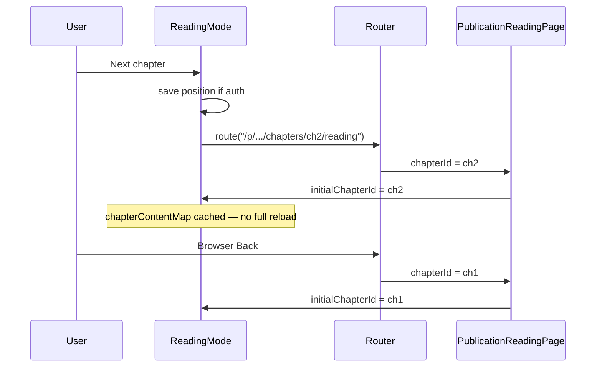

# Addressable UI state (SPA URL sync)

## The problem: address-bar drift

In a single-page app (SPA), the UI can change without a full page reload. If only React/Preact state updates, the **address bar stays on the entry URL**.

That causes:

- **F5** — user returns to the first opened view, not the current one
- **Share** — copied link points to the wrong chapter or filter
- **Back** — browser history does not match in-app navigation

We call this **address-bar drift**: the screen shows view A, the URL describes view B.

## The fix: URL as canonical view

**Shareable state belongs in the URL** (path segments or query params). The SPA updates the URL with `preact-router` `route()` — no full reload — and derives the UI from router props or `URLSearchParams`.

Ephemeral state (scroll within a chapter, modal open, form drafts) stays off-URL or in the API.

Policy SSOT: [[_canonical/rules/spa-navigation]] (`.cursor/rules/spa-navigation.mdc`).

## Reading mode (reference flow)

Chapter navigation was the first full adoption of this pattern:

Code references:

- `src/client/utils/readingRoutes.ts` — `buildReadingChapterUrl()`
- `src/client/components/ReadingMode/index.tsx` — `syncChapterUrl`, `navigateToChapterIndex`
- [[_canonical/rules/routing#Reading mode URL sync]] — route contract

## Full reload vs SPA navigation

|           | Full reload (`location.href = …`) | SPA `route(url)`                                   |
| --------- | --------------------------------- | -------------------------------------------------- |
| Network   | Re-downloads HTML, re-runs boot   | Same document; router swaps view                   |
| State     | All in-memory state lost          | Component cache can persist (e.g. loaded chapters) |
| History   | New entry                         | `pushState` entry; Back works                      |
| Analytics | One page view                     | `arcane:route-change` on `AppRouter`               |

Arcane Reader uses **SPA navigation** for in-app chapter and catalog changes.

## What stays off the URL

| State                           | Why                         | Where                                          |
| ------------------------------- | --------------------------- | ---------------------------------------------- |
| Paragraph scroll (auth readers) | Fine-grained; changes often | `PATCH /api/publications/:id/reading-position` |
| Modal open                      | Not shareable               | Component state                                |
| Reader font/theme               | User preference             | User/project settings API                      |
| Glossary modal                  | Transient overlay           | Component state                                |

Guests reloading mid-chapter get the correct **chapter** from URL but start at the top of the chapter (acceptable v1). Optional v2: `?paragraph=` — see [[05-plans/app-wide-url-sync-rollout]].

## Other patterns in the codebase

| Screen          | Mechanism                                                |
| --------------- | -------------------------------------------------------- |
| Catalog filters | `buildCatalogUrl` + `route()` in `HomePage.tsx`          |
| Chapter editor  | Path `:chapterId` + `?search=`, `?paragraph=`            |
| Admin           | Separate routes (`/admin/news`, `/admin/entities/:kind`) |
| Debug console   | Query + `replaceState` in `useUrlSync.ts` (dev only)     |

## Rollout

Phased adoption across the app: [[05-plans/app-wide-url-sync-rollout]].

How to implement in a new feature: [[02-how-to/sync-url-with-ui-state]].
