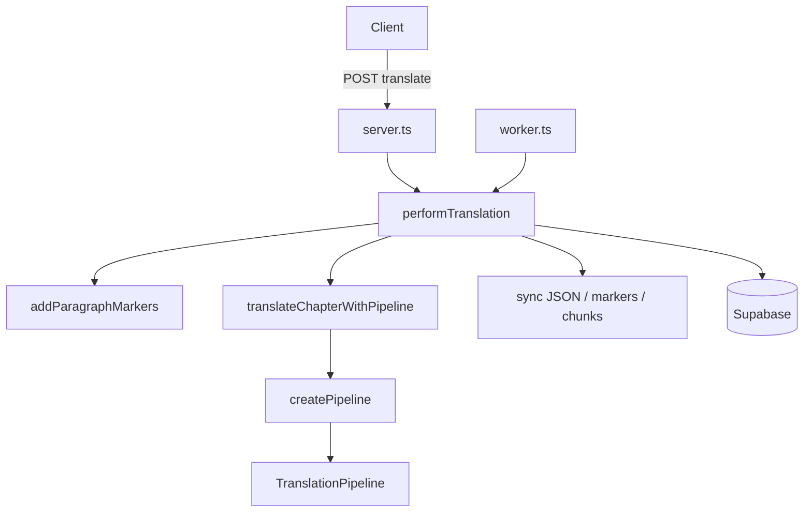

# Engine integration boundary (as-is)

How Arcane Engine connects to Express API, worker, and Supabase. Engine code in `src/engine/` has **no HTTP or DB** — all persistence lives here and in `src/server.ts`.

Pipeline internals: [[engine-pipeline]]. Glossary/prompts/markers: [[engine-glossary-and-prompts]].

Supersedes structural content from `docs/archive/ENGINE_E2E.md` (verify against code, do not copy stale archive text).

## Responsibility split

| Layer                     | Owns                                                                                                                |
| ------------------------- | ------------------------------------------------------------------------------------------------------------------- |
| **Engine**                | LLM calls, 3 stages, in-memory `NovelAgent`, chunking, prompt building                                              |
| **engine-integration.ts** | `createPipeline`, `translateChapterWithPipeline`, `analyzeChaptersBatch`, agent cache, glossary mapping to DB types |
| **server.ts**             | Routes, `performTranslation`, paragraph markers, sync to paragraphs, draft save, cancel registry, token limits      |
| **Worker**                | BullMQ jobs → same `performTranslation` / `analyzeChaptersBatch`                                                    |
| **Supabase**              | Chapters, glossary, token usage, job state                                                                          |



## Entry points

### `createPipeline(config, project)`

- Builds three `OpenAIProvider` instances from `project.settings.stageModels` or fallback model.
- `getAgentForProject(project)` — cached agent loaded with project glossary.
- Returns `TranslationPipeline`.

### `translateChapterWithPipeline(config, project, chapter, options)`

Maps API `stages` to `PipelineOptions.runStages`:

| API `stages`                | Pipeline behavior                                             |
| --------------------------- | ------------------------------------------------------------- |
| `'all'`                     | analysis → translation → editing (unless skipped by settings) |
| `['analysis']`              | analysis only                                                 |
| `['translation']`           | translation (and analysis if not skipped)                     |
| `['editing']`               | editing only; needs `existingTranslatedText`                  |
| `['translation','editing']` | both without re-analysis                                      |

Passes app config: `maxTokensPerChunk`, `neverSplitParagraphs`, retry/parallel settings, glossary flags from project settings, `textBlockTypes`, `customInstructions`, editing preset/focus.

**Returns:** `translatedText`, token breakdown, glossary updates, `cancelled?`, chunk metadata — server persists.

### `analyzeChaptersBatch`

- Cache-aware batch analysis.
- `pipeline.analyzeChaptersParallel` (default concurrency 4).
- Server merges results into DB glossary + chapter `analyzed` status.

### Worker

- `runTranslateJob` → dynamic import `performTranslation` from `server.ts` (same code path as sync API).
- `runAnalysisJob` → `analyzeChaptersBatch`.
- Requires `REDIS_URL` and `npm run worker` / `dev:full`.

## E2E: single chapter translate

### 1. API entry

```
POST /api/projects/:projectId/chapters/:chapterId/translate
Body: { translateOnlyEmpty?, paragraphIds?, stages?: ('analysis'|'translation'|'editing')[] | 'all' }
```

- Auth: `requireAuth`, project ownership.
- If `chapter.status === 'translating'` → `409 ALREADY_RUNNING`.
- Source text: `chapter.originalText` or merged `paragraphs[].originalText`.

### 2. Before background work

1. Token limit check (`checkTokenLimit`) → `429` if exceeded.
2. `updateChapter(..., { status: 'translating' })`.
3. Fire-and-forget `performTranslation(...)` (not awaited on request thread).
4. Response: `200 { status: 'started', chapterId }`.

Client polls `GET .../chapters/:id/status` (or project) for `chunksDone` / `totalChunks` during translate.

### 3. `performTranslation` (server)

**Cancel:** `translationCancelRegistry` key `(projectId, chapterId)`. `POST .../translate/cancel` sets flag; `isCancelled` passed into pipeline options.

**Paragraph markers:** before engine call, `addParagraphMarkers` prefixes each paragraph with `--para:{id}--` (or `auto_N` if no DB match).

**Engine call:** `translateChapterWithPipeline` with stage list derived from API `stages`.

**Analysis-only:** saves glossary entries, `status: 'analyzed'`, no chapter translation text.

### 4. Two-phase save (translation + editing)

When editing runs after translation in the same job:

1. **Phase 1:** `stages` without editing only, or combined — server may run translation first.
2. After Stage 2 success: **draft save** — `updateChapter` with `status: 'draft'`, `translatedText`, synced `paragraphs`, partial `translationMeta`.
3. **Phase 2:** second `translateChapterWithPipeline` with `stages: ['editing']`, `existingTranslatedText: buildMarkedTextFromParagraphs(syncedParagraphs)`.
4. Final save: `status: 'completed'` (or `error` on validation failure).

Refactor note: draft-between-phases is **implemented** (see `server.ts` ~4747+). Not an open refactor item.

### 5. After pipeline — paragraph sync

Order of attempts on `result.translatedText`:

1. **JSON** — `paragraphs[]` from model → `syncTranslationJSONToParagraphs`
2. **Marker text** — `parseEditedTextByMarkers` → `syncEditedMarkersToParagraphs`
3. **Plain chunks** — split `\n\n` → `syncTranslationChunksToParagraphs`

Subset translate (`paragraphIds`): merge synced paragraphs back into full chapter list.

**Recovery:** `POST .../translate/sync` — manual chunk → paragraph sync.

### 6. Persistence fields

Typical `updateChapter` payload:

- `translatedText`, `translatedChunks`, `paragraphs`
- `status`: `completed` \| `draft` \| `error` \| `analyzed` \| `pending` (on cancel after analysis)
- `translationMeta`: tokens, duration, models, `chunksCount`, `failedChunkIndex`, `lastAnalysisAt`

Token usage: `incrementTokenUsage` (non-blocking warn on failure).

## Async batch

```
POST .../chapters/translate-batch  (?async=1 or Prefer: respond-async)
POST .../chapters/analyze-batch
```

- Returns `202` + `jobId` when Redis/worker available; else sync or `503`.
- Poll: `GET .../translate-jobs/:jobId` / `analysis-jobs/:jobId`.
- Cancel: job cancel endpoints + same `translationCancelRegistry` for in-process translate.

See [[../_canonical/rules/routing]] — Async Jobs.

## Cancel behavior

| When cancelled | Server behavior                                                  |
| -------------- | ---------------------------------------------------------------- |
| After Stage 1  | `PipelineResult.cancelled`; save glossary, `status: pending`     |
| Mid chunk      | pipeline throws `'Cancelled'`; chapter error/pending per handler |
| Via job        | `externalIsCancelled` from Redis/KV in worker options            |

## External services

| Service      | Role in translate flow                         |
| ------------ | ---------------------------------------------- |
| **OpenAI**   | LLM inside engine stages (per-stage model)     |
| **Supabase** | CRUD chapters, glossary, profiles, token usage |
| **Redis**    | Job queues, optional cancel flags, cache       |

## What engine does not do

- No `updateChapter`, no glossary DB writes
- No JWT, no rate limits
- No paragraph marker injection (server only)
- No BullMQ enqueue

## Debugging

See [[../02-how-to/debug-translation]] — sync vs async, log levels, Stage 3 mismatch recovery.

## Related

- [[engine-pipeline]]
- [[engine-glossary-and-prompts]]
- [[../05-plans/engine-refactor]]
- Routes: [[../_canonical/rules/routing]]
