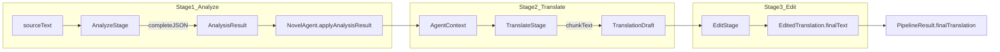

# Engine pipeline (as-is)

Arcane Engine orchestrates a **3-stage** translation pipeline inside `src/engine/`. This note describes current behavior before refactor. For glossary/prompts see [[engine-glossary-and-prompts]]; for server persistence and E2E see [[engine-integration-boundary]]. For **execution modes** (Lab and future prod settings) see [[prompt-lab-engine-config]].

**Do not trust** `docs/archive/TRANSLATION_*.md` or `ENGINE_E2E.md` without verifying against `src/`.

## Module map

| Path                                          | Responsibility                                     |
| --------------------------------------------- | -------------------------------------------------- |
| `src/engine/pipeline/translation-pipeline.ts` | `TranslationPipeline` — stage orchestration        |
| `src/engine/stages/stage-1-analyze.ts`        | `AnalyzeStage`                                     |
| `src/engine/stages/stage-2-translate.ts`      | `TranslateStage`                                   |
| `src/engine/stages/stage-3-edit.ts`           | `EditStage`                                        |
| `src/engine/agents/novel-agent.ts`            | In-memory project context, glossary state          |
| `src/engine/utils/chunker.ts`                 | `chunkText`, `mergeChunks`, `splitIntoSections`    |
| `src/engine/types/pipeline.ts`                | `PipelineOptions`, `PipelineResult`, `StageResult` |
| `src/engine/providers/openai.ts`              | `OpenAIProvider` (`ILLMProvider`)                  |
| `src/engine/index.ts`                         | Public barrel exports                              |

## Stage flow

### Stage 1 — Analyze

- **Input:** chapter `sourceText`, `chapterNumber`, optional `existingGlossary`.
- **LLM:** `completeJSON` via `createAnalyzerPrompt`.
- **Long chapters:** `splitIntoSections` when `analysisMaxSectionTokens` exceeded (default 8000; `0` disables).
- **Output:** `AnalysisResult` — characters, locations, terms, style notes, chapter summary, key events, `glossaryUpdate`.
- **Side effect:** `NovelAgent.applyAnalysisResult` updates agent state (not persisted until server saves).

### Stage 2 — Translate

- **Input:** `sourceText` + `AgentContext` (glossary filtered by chapter, then per chunk).
- **Chunking:** `chunkText` with `maxTokens` = `chunkSize` (see matrix below), `preserveParagraphs: true`, `neverSplitParagraphs` (default true).
- **LLM:** primary JSON `{ paragraphs: [{ id, translated }] }`; fallback plain text with `\n\n`.
- **Para markers:** if model returns ids matching `--para:...--`, text is reassembled with markers preserved (see [[engine-glossary-and-prompts#Paragraph markers]]).
- **Retries:** per-chunk retry (`chunkRetryAttempts` default 2, delay 1500 ms).
- **Parallelism:** `parallelChunks` (default 1 = sequential).
- **Output:** `TranslationDraft` — `translatedText`, `chunkResults[]`.

### Stage 3 — Edit

- **Input:** `stage2.translatedText`; `sourceText` is passed to `EditStage.execute` for `detectChanges` and optional quality check only — **not** included in the main edit user prompt.
- **Chunking:** `chunkText(translatedText only)` — **independent** boundaries from Stage 2.
- **Glossary:** chapter-scoped (`filterGlossaryByChapter`), then per-chunk via `filterGlossaryForChunk(..., 'target')`; formatted with `toEditPromptText` / `toEditCastPromptText` (target-language forms only). See [[#Stage inputs and prompts (as-is)]].
- **Quality check:** optional `completeJSON` after chunked edit (`checkQualityForChunked`, default false); when run, sends **both** original and translation plus target-only glossary.
- **On failure:** pipeline uses raw Stage 2 translation as `finalTranslation`.
- **Known limitation:** Stage 3 chunk boundaries are not aligned with Stage 2 chunk boundaries. Open work: [[05-plans/engine-pipeline-improvements]].

## Stage inputs and prompts (as-is)

Before Stage 2 and Stage 3, `TranslationPipeline` applies `filterGlossaryByChapter(glossary, chapterNumber)` via `ctxForTranslateEdit()` in `translation-pipeline.ts`.

Glossary chunk filtering, script-aware matching, and prompt format helpers: [[engine-glossary-and-prompts#Filtering]].

### Summary matrix

|                            | **Stage 1 Analyze**                                   | **Stage 2 Translate**                                      | **Stage 3 Edit**                                                |
| -------------------------- | ----------------------------------------------------- | ---------------------------------------------------------- | --------------------------------------------------------------- |
| **Text in user prompt**    | Source (`sourceText` / section)                       | Source (chunk)                                             | **Translated text only** (chunk)                                |
| **System prompt**          | `pairs/{src}-{tgt}/analyzer` + metadata language rule | `pairs/{src}-{tgt}/translator` + `appendGenderAgreement`   | `getEditorSystemPrompt(preset, focus, tgt)` + gender            |
| **Glossary scope**         | **Full** glossary (if `includeGlossaryInAnalysis`)    | Chapter-scoped → per-chunk filter                          | Chapter-scoped → per-chunk filter                               |
| **Chunk filter**           | —                                                     | `matchMode: source` (original in source chunk)             | `matchMode: target` (translated forms in edit chunk)            |
| **Glossary format**        | `toPromptText` — `orig → tr`                          | `toPromptText` — `orig → tr`                               | `toEditPromptText` — target only (+ declensions for characters) |
| **Chapter cast**           | —                                                     | `toCastPromptText` — `orig → tr [m/f]` in Previous Context | `toEditCastPromptText` — `tr [m/f]`                             |
| **Chunk glossary default** | —                                                     | **off** in full pipeline; **on** in translate-only         | **on** (3000 tok)                                               |
| **Source in LLM prompt**   | yes                                                   | yes                                                        | **no** (except optional quality check)                          |

### User prompt section order

**Analyze** (`buildAnalyzerUserPrompt`):

1. Intro (source → target)
2. `## Existing Glossary` — full bilingual `toPromptText` (optional)
3. Metadata language rules
4. `## Source Text`

**Translate** (`buildTranslatorUserPrompt`):

1. Target language anchor
2. `## Previous Context` — chapter cast (`toCastPromptText`), events, active characters, prior summaries
3. `## Glossary` — chunk-filtered bilingual `toPromptText` (when `includeGlossaryInTranslation`)
4. `## Style Guide`
5. Text block types (if configured)
6. Custom instructions
7. `## Text to Translate` — source chunk

**Edit** (`createEditorPrompt`):

1. Editor target language anchor
2. Chapter cast — `toEditCastPromptText` (target names + `[m/f/n/?]`)
3. `## Reference Glossary` — chunk-filtered `toEditPromptText` (when `includeGlossaryInEditing`)
4. `## Style Notes`
5. Custom instructions
6. `## Translation to Edit` — translated chunk only

### By source language (en / ko / zh / ru)

Whitelist: `src/engine/language.ts` — 7 pairs (`en|ko|zh→ru`, `en|ko|zh|ru→be`).

| Aspect                  | en                                       | ko / zh                                                          | ru (only `ru→be`)           |
| ----------------------- | ---------------------------------------- | ---------------------------------------------------------------- | --------------------------- |
| Pair prompts            | `en-ru`, `en-be`                         | `ko-ru`, `zh-ru`, `ko-be`, `zh-be`                               | `ru-be`                     |
| Analyze JSON names      | Latin, capitalized                       | CJK in `originalName`; Cyrillic `suggestedTranslation` for ru/be | Cyrillic → Belarusian forms |
| Chunk match (Translate) | `\b` word boundaries                     | substring (≥2 chars)                                             | substring                   |
| Chunk match (Edit)      | `translated` + declensions               | same                                                             | same                        |
| DB reload               | EN translit + Petrovich when target `ru` | `translated` from DB; no EN translit                             | `translated` as-is          |

### Manual verification (zh→ru)

1. **Analyze** — prompt has `Existing Glossary` with `张三丰 → …` and full source text.
2. **Full pipeline Translate** — no per-chunk glossary section; bilingual cast in Previous Context.
3. **Edit** — cast `Ли Мин [f]` without Han characters; Reference Glossary target-only; no Chinese source section.
4. **Translate-only** — per-chunk bilingual glossary matched on source script.

Automated flow checks: `npm run test -- src/engine/pipeline/stage-prompt-flow.test.ts`.

## TranslationPipeline API

| Method                                                  | Purpose                                    |
| ------------------------------------------------------- | ------------------------------------------ |
| `translateChapter(sourceText, chapterNumber, options?)` | Full or partial pipeline for one chapter   |
| `translateChapters(chapters[], options?)`               | Sequential multi-chapter                   |
| `analyzeChaptersParallel(chapters[], options?)`         | Analysis-only batch; default concurrency 4 |

### PipelineConfig

- **Legacy:** single `provider` for all stages.
- **Current:** `providers: { analysis, translation, editing }` — each must implement `complete`; analysis needs `completeJSON`; editing needs `complete` (quality check needs `completeJSON` or check is skipped).
- **Agent:** `NovelAgent` instance (cached per project in integration layer).

### Stage selection (`PipelineOptions`)

| Option                                                    | Behavior                                                                                                   |
| --------------------------------------------------------- | ---------------------------------------------------------------------------------------------------------- |
| `runStages: ('analysis' \| 'translation' \| 'editing')[]` | Run only listed stages in order                                                                            |
| `runOnlyStage`                                            | Legacy single-stage shortcut                                                                               |
| `skipAnalysis` / `skipEditing`                            | Skip when not using `runStages`                                                                            |
| `existingTranslatedTextForEdit`                           | Required for editing-only paths                                                                            |
| `isCancelled?: () => boolean`                             | Throws `'Cancelled'` between stages/chunks; after Stage 1 may return `cancelled: true` on `PipelineResult` |
| `onProgress?(done, total, stage?)`                        | Chunk progress for UI/jobs                                                                                 |

**Analysis-only:** returns empty `finalTranslation`; server saves glossary and sets `analyzed`.

**Editing-only:** uses `existingTranslatedTextForEdit`; dummy Stage 1/2 in result.

## Chunk size matrix (pipeline defaults)

Constants in `translation-pipeline.ts`:

| Scenario                              | Translation chunk                     | Glossary in translate          | Edit chunk | Glossary in edit |
| ------------------------------------- | ------------------------------------- | ------------------------------ | ---------- | ---------------- |
| Translate only (no Stage 3)           | 2000                                  | yes (default)                  | —          | —                |
| Full pipeline (translate + edit)      | 3500                                  | **no** (terms aligned in edit) | 2000       | yes (default)    |
| `includeGlossaryInTranslation: false` | 3500                                  | no                             | —          | —                |
| `includeGlossaryInEditing: false`     | —                                     | —                              | 3500       | no               |
| `chunkSize` override                  | replaces defaults for affected stages |                                |            |                  |

App config also sets `maxTokensPerChunk`, `neverSplitParagraphs`, `parallelChunks` via `engine-integration.ts` → `PipelineOptions`.

## Chunker behavior (`utils/chunker.ts`)

- **Token estimate:** tiktoken `cl100k_base` when available; else heuristic (~4 chars/token Latin, ~1 CJK).
- **Paragraph mode:** split on `\n\n+`, merge paragraphs into chunks under `maxTokens`.
- **`neverSplitParagraphs` (default true):** oversized paragraph stays one chunk (may exceed `maxTokens`); legacy sentence-split only when explicitly false.
- **`separatorAfter`:** preserved on chunks for accurate `mergeChunks`.

## PipelineResult

Returned by `translateChapter`:

- `stage1`, `stage2`, `stage3`: each `StageResult<T>` with `tokensUsed`, `duration`, `success`, `error?`.
- `finalTranslation`: text after last successful stage.
- `updatedContext`: `AgentContext` for glossary merge on server.
- `cancelled?`: true when user cancelled after Stage 1 (server should save glossary, not full translation).

## Public exports vs internal

**Exported from `src/engine/index.ts`:** pipeline, stages, agent, glossary helpers, declension, chunker utils, prompts, error constants, types.

**Not in index (used by export services):**

- `src/engine/utils/text-blocks.ts`
- `src/engine/constants/text-block-presets.ts`

## Logging

Engine code uses `log` from `src/engine/logger.js` (wrapper over app Pino `logger`). English messages only. See [[../_canonical/rules/logging]].

## Related

- [[translation-pipeline]] — index to engine docs
- [[engine-glossary-and-prompts]]
- [[engine-integration-boundary]]
- [[../02-how-to/debug-translation]]
- [[../05-plans/engine-pipeline-improvements]]
- Canonical rule: [[../_canonical/rules/engine]]
