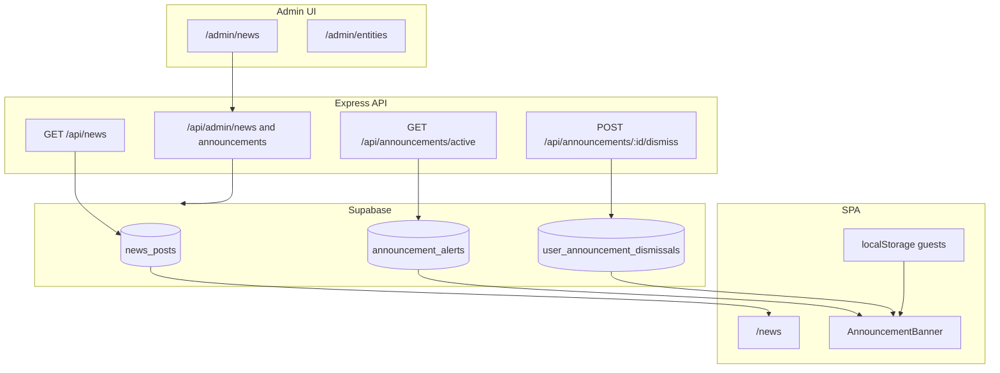
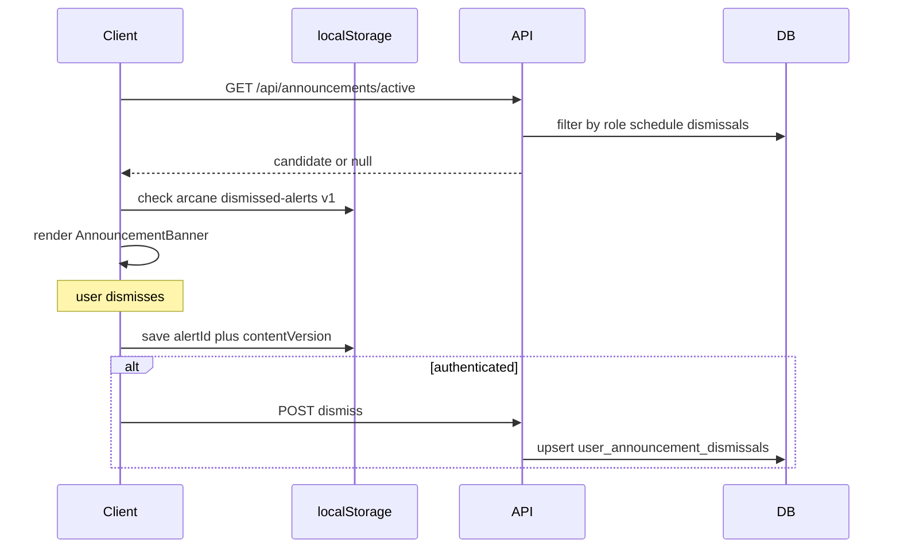

# News feed and announcement banners

## Overview

Arcane has two related but separate surfaces for product messaging:

| Layer                   | User-facing                            | Purpose                                                        |
| ----------------------- | -------------------------------------- | -------------------------------------------------------------- |
| **News feed**           | `/news`, `/news/:slugOrId` (Info menu) | Full posts: release notes, features, promos. Always browsable. |
| **Announcement banner** | Horizontal strip under header          | Short message (≤160 chars) + optional CTA. Dismissible.        |

A news post can spawn a banner via admin **Create announcement**, but the feed does not track "read" state separately — the banner is the proactive nudge; the feed is the archive.

Route map (SSOT): [[_canonical/rules/routing]].

## Architecture

## Data model

### `news_posts`

Published posts are public (RLS: `status = 'published'`). Drafts and archived posts are admin-only (service role).

Key fields: `title`, `summary`, `body` (markdown), `category` (`feature` | `discount` | `update` | `other`), `slug`, `published_at`, `translations` jsonb (reserved for future AI i18n).

### `announcement_alerts`

Short banner config. Optional `news_post_id` FK. Schedule via `starts_at` / `ends_at`. `min_role` gates audience. `content_version` increments when admin wants to re-show after dismiss. `priority` picks the single active alert when several qualify.

### `user_announcement_dismissals`

Per-user record: `(user_id, announcement_id)` + `content_version` at dismiss time. RLS: user owns row only.

Migration: `docs/supabase-migrations/20250618_news_and_announcements.sql` (applied to Supabase project `arcane`, 2026-06-18).

## Dismiss flow

**localStorage key:** `arcane:dismissed-alerts:v1` — `{ schemaVersion: 1, items: { [alertId]: contentVersion } }`.

**Re-show:** Admin bumps `content_version` on the alert. Client treats stored version as stale and shows banner again; GA fires a new `announcement_view`.

## Role targeting

`min_role` on alerts uses the same hierarchy as [[_canonical/rules/auth]] (`guest` < `user` < `author` < … < `admin`). Unauthenticated visitors are `guest`. API filters alerts where `isAtLeastRole(userRole, min_role)`.

## Banner UX rules

- Non-modal horizontal bar (same band as `ServiceStatusBanner`).
- **Hidden** when service health banner is active (down/degraded).
- At most **one** banner: highest `priority` wins.
- `role="region"` (not `role="alert"`) for promo content.
- Dismiss: × button, Escape (when dismissible), min 44px touch target.
- Max one CTA button (e.g. "Learn more" → `/news/:slug`).

Implementation: `src/client/components/AnnouncementBanner.tsx`, `src/client/contexts/AnnouncementContext.tsx`.

## Analytics (GA4)

Events fire only after cookie consent (`VITE_GA_MEASUREMENT_ID` + user accepts cookies). Helpers in `src/client/utils/analytics.ts`:

| Event                    | When                               | Parameters                                      |
| ------------------------ | ---------------------------------- | ----------------------------------------------- |
| `announcement_view`      | Banner shown (once per id+version) | `announcement_id`, `variant`, `content_version` |
| `announcement_cta_click` | CTA clicked                        | + `cta_url`                                     |
| `announcement_dismiss`   | Dismiss (× or Escape)              | `announcement_id`, `variant`, `content_version` |

Internal navigation to `/news/...` also records a normal `page_view`.

## i18n

- **UI labels:** `src/client/locales/en.json`, `ru.json`, `be.json`.
- **Post content:** MVP is RU (`primary_locale: ru`). `translations` jsonb is stored but not rendered until AI translate is implemented (`POST /api/admin/news/:id/translate` returns 501).

## Related

- Admin operations: [[02-how-to/manage-news-announcements]]
- Archived plan: [[05-plans/news-and-announcements]]
