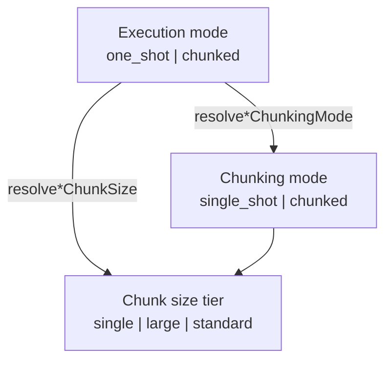
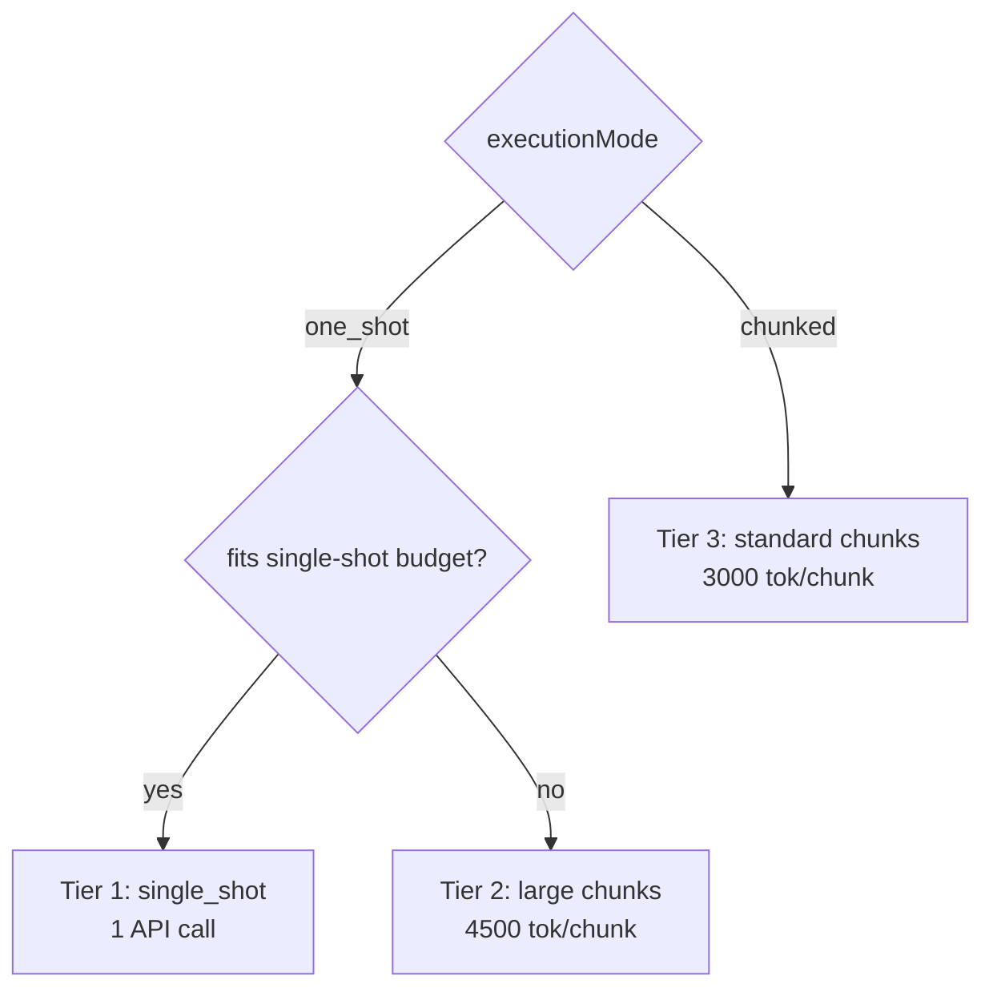
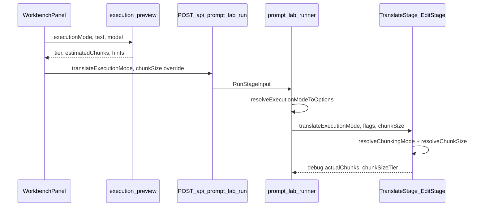

# Prompt Lab: engine execution configuration

Prompt Lab is the **sandbox for engine execution parameters** — not only prompts. Use this document when migrating Lab settings to production Reader or aligning workflows.

## Truth hierarchy

1. **Code** (`src/engine/`, `src/shared/`, `src/prompt-lab/`) — behavior
2. **`.cursor/rules/engine.mdc`** — chunk size defaults table
3. **This document** — execution modes, tiered chunking, Lab vs prod contract
4. **`docs/02-how-to/prompt-lab.md`** — how to use the Lab UI

## Role of Lab in engine evolution

Prompt Lab runs the **same engine stages** as production (`AnalyzeStage`, `TranslateStage`, `EditStage`) with the same chunking policies and glossary filters.

| Lab                                                     | Production                                                           |
| ------------------------------------------------------- | -------------------------------------------------------------------- |
| Optional `systemPromptOverride` / `userPromptOverride`  | Baseline prompts from `src/engine/` only                             |
| Explicit `translateExecutionMode` / `editExecutionMode` | Same fields on project settings; resolver in `engine-integration.ts` |
| Ephemeral runs; optional save to `prompt_lab_runs`      | Persists to `chapters`, jobs via worker                              |
| Execution plan preview in UI                            | Not in Settings (no chapter text); optional P2 on chapter UI         |

**Migration pattern:** validate a configuration in Lab → promote the same SSOT modules and `PipelineOptions` fields to project settings / `engine-integration.ts`. Do not fork logic in the client.

## Configuration layers

Three layers — do not conflate them in UI labels or logs:

| Layer               | Field / type                                  | Set by                         | Example                                   |
| ------------------- | --------------------------------------------- | ------------------------------ | ----------------------------------------- |
| **Execution mode**  | `translateExecutionMode`, `editExecutionMode` | Workbench UI, run params       | `one_shot`                                |
| **Chunking mode**   | `single_shot` \| `chunked`                    | Policy after budget check      | `chunked`, reason `one_shot_large_chunks` |
| **Chunk size tier** | `single` \| `large` \| `standard`             | Size resolver + Execution plan | `large` → 4500 tok                        |

**Execution mode** is the user-facing choice. **Chunking mode** is what the engine actually does for a given chapter length. **Tier** describes chunk token size and UI labels (`Single request`, `~N large chunks`, `~N chunks`).

## SSOT module map

| Module                                      | Responsibility                                                                                        |
| ------------------------------------------- | ----------------------------------------------------------------------------------------------------- |
| `src/shared/translate-execution-modes.ts`   | Translate modes, CoT/few-shot/leading mapping, per-model defaults, legacy normalize                   |
| `src/shared/edit-execution-modes.ts`        | Edit modes, style/focus mapping, thresholds, legacy normalize                                         |
| `src/shared/translationChunkPresets.ts`     | Constants 3000 / 4500 / 1200; `resolveTranslationChunkSize`, `resolveChunkSizeTier`                   |
| `src/engine/translate-chunking-policy.ts`   | `canSingleShotTranslate`; reasons `one_shot_fits_budget`, `one_shot_large_chunks`, `chunked_standard` |
| `src/engine/edit-chunking-policy.ts`        | Edit budget; `short_draft_direct`; tier chunk sizes                                                   |
| `src/engine/translate-optimization.ts`      | Bridges mode + chunking mode → flags and effective chunk size                                         |
| `src/engine/translate-execution-preview.ts` | Live Execution plan (translate)                                                                       |
| `src/engine/edit-execution-preview.ts`      | Live Execution plan (edit)                                                                            |
| `src/engine/utils/chunker-core.ts`          | Browser-safe `chunkText` for preview UI (no Node `logger` / `async_hooks`)                            |
| `src/engine/utils/chunker.ts`               | Server chunker; re-exports core + `mergeChunks` logging                                               |
| `src/prompt-lab/runner.ts`                  | Wires mode → flags → stage options → run debug output                                                 |

Legacy re-exports (deprecated names): `translate-quality-presets.ts`, `edit-quality-presets.ts` → forward to execution-modes modules.

## Translate execution modes

Modes replace legacy **Fast / Standard / Enhanced** presets.

|                 | `one_shot`                           | `chunked`     |
| --------------- | ------------------------------------ | ------------- |
| CoT             | on                                   | off           |
| Few-shot        | on                                   | off           |
| Leading context | 2 paragraphs (when chunked fallback) | 0             |
| Chunking        | Tier 1 if budget fits; else tier 2   | Always tier 3 |

### Tier resolution (translate)

| Tier         | When                                  | Chunk size          | `chunkingReason`        |
| ------------ | ------------------------------------- | ------------------- | ----------------------- |
| 1 — Single   | `one_shot` + `canSingleShotTranslate` | n/a (whole chapter) | `one_shot_fits_budget`  |
| 2 — Large    | `one_shot` + overflow                 | 4500                | `one_shot_large_chunks` |
| 3 — Standard | `chunked` (always)                    | 3000                | `chunked_standard`      |

**Anchor benchmark:** ~3000 CJK characters + ~50 glossary entries → `one_shot`, single API call on `gpt-5.4-mini` / `o4-mini` (~10k output chars ru).

**Default mode per model** (`defaultExecutionModeForModel`):

| Model                     | Default mode |
| ------------------------- | ------------ |
| `gpt-5.4-mini`, `o4-mini` | `one_shot`   |
| `gpt-4.1-mini` and others | `chunked`    |

Budget check (`canSingleShotTranslate`) uses CJK-aware **heuristic** token estimates + CoT overhead (~2000 tok) + expansion factor (ru/be ×1.4). Output cap: min(model max, `resolveTranslateLlmDefaults().maxTokens`) × 0.9.

## Edit execution modes

|                   | `one_shot`        | `chunked`                                  |
| ----------------- | ----------------- | ------------------------------------------ |
| Style preset      | `literary`        | `default`                                  |
| Focus             | `polish`          | `polish`                                   |
| `forceSingleShot` | true              | false                                      |
| Short draft       | single API call   | single if ≤3000 tok (`short_draft_direct`) |
| Long draft        | large chunks 4500 | standard chunks 3000                       |

Edit auto-chunk threshold: `EDIT_AUTO_CHUNK_TOKEN_THRESHOLD` = 3000 tok (heuristic on draft text).

## Execution plan (preview before run)

Workbench (`WorkbenchPanel`) calls preview builders on the client:

- **Translate:** `buildTranslateExecutionPreview`
- **Edit:** `buildEditExecutionPreview`

`estimatedChunks` = `chunkText()` from `chunker-core` with the **effective chunk size** for the resolved tier (tiktoken when bundled). This is **not** `ceil(chars / chunkSize)`.

**Intentional split:** chunking **policy** (single vs chunked) uses heuristic estimates (`token-estimate.ts`); **preview chunk count** uses tiktoken. Counts can differ on highly compressible Latin repeats; they align on CJK-heavy chapters (production novels).

After a run, debug fields on the run output:

| Field                               | Meaning                           |
| ----------------------------------- | --------------------------------- |
| `translateDebug.actualChunks`       | Chunks processed at runtime       |
| `translateDebug.chunkSizeTier`      | `single` \| `large` \| `standard` |
| `translateDebug.effectiveChunkSize` | Token size used                   |
| `translateDebug.chunkingReason`     | Policy reason string              |

Edit stage exposes analogous fields on `editDebug`.

## Data flow: Workbench → API → engine

Runner default chunk size: `input.chunkSize ?? config.translation.maxTokensPerChunk` (3000). Lab no longer auto-applies 1200 for mini model names without `miniModelTranslationProfile`.

## Translate output contract (Lab + engine)

| Layer                           | Behavior                                                                                                                                |
| ------------------------------- | --------------------------------------------------------------------------------------------------------------------------------------- |
| Model wire format               | JSON `{ paragraphs: [{ id, translated }] }` (optional `analysis` when CoT)                                                              |
| `TranslateStage`                | `completeJSON` / structured → `mergeJsonParagraphsToMarkedText`; **text fallback** also unwraps via `tryParseTranslationParagraphsJson` |
| Prompt Lab `output.text`        | Marked/plain text only (`normalizeLabTranslatedText` in runner + UI save/load)                                                          |
| Production `performTranslation` | Additional JSON sync in `server.ts` when saving chapters                                                                                |

SSOT: `src/engine/utils/para-markers.ts` (`tryParseTranslationParagraphsJson`, `normalizeLabTranslatedText`). Do not pass raw JSON into Edit draft or Review compare.

## Persistence and legacy

Run snapshot in `prompt_lab_runs.params`:

| Preferred field          | Legacy field             | Normalize                                              |
| ------------------------ | ------------------------ | ------------------------------------------------------ |
| `translateExecutionMode` | `translateQualityPreset` | `enhanced` → `one_shot`; `fast`/`standard` → `chunked` |
| `editExecutionMode`      | `editQualityPreset`      | same                                                   |

Zod schema (`src/api/schemas/prompt-lab.ts`) accepts legacy values and transforms on ingest.

Infer mode from old granular flags (`inferExecutionModeFromLegacyParams`): CoT / few-shot / leading context / `miniModelTranslationProfile` → `one_shot`; otherwise `chunked`.

## Lab vs production (migration reference)

| Aspect                   | Prompt Lab (now)                         | Production Reader (after migration)                                                      | Migration step                            |
| ------------------------ | ---------------------------------------- | ---------------------------------------------------------------------------------------- | ----------------------------------------- |
| Translate execution mode | UI selector → passed to `TranslateStage` | `resolveTranslatePipelineOptions()` in `engine-integration.ts` → `PipelineOptions`       | Done — project settings + auto from model |
| Chunk size default       | `config.maxTokensPerChunk` (3000)        | Tier from mode; explicit override only via `settings.chunkSize`                          | Done                                      |
| CoT / few-shot           | From execution mode                      | From execution mode via resolver                                                         | Done                                      |
| Edit execution mode      | UI selector                              | `resolveEditPipelineOptions()` in `translation-pipeline.ts`                              | Done                                      |
| Execution plan UI        | Live preview + post-run debug            | Optional in chapter translate UI (P2)                                                    | Not yet                                   |
| Settings UI              | Workbench + Advanced overrides           | `SettingsModal`: 3 translate/edit models, Standard/Advanced per stage (Lab-like main UX) | Done                                      |

**Principle:** reuse `resolveExecutionModeToTranslateOptions`, `resolveTranslateChunkingMode`, and siblings in prod — do not duplicate tier logic in the client.

Prod **Settings** mirrors Lab’s main controls: model pickers (`modelsForProdSettings`), **Standard** (`chunked`) vs **Advanced** (`one_shot`) for translate and edit. Granular overrides (`chunkSize`, `forceChunked`, `miniModelTranslationProfile`, structured CoT) remain in the API for Lab and power users but are not exposed in prod UI.

**Chapter translate panel** (`TranslationPanel`) does not set execution mode — it only chooses scope, stages, and optional language override. Mode comes from project settings. New projects default to **Advanced** (`one_shot`) for translate and edit. On long chapters the engine still splits automatically (large parts, 4500 tok) when a single request would exceed the model budget; short chapters run in one pass. Change mode in **Project settings**, not on the chapter panel.

### Prod integration touchpoints (when migrating)

1. `src/services/engine-integration.ts` — pass `translateExecutionMode` / `editExecutionMode` from project config
2. `src/engine/types/pipeline.ts` — ensure options are on `PipelineOptions` (translate mode already on `TranslateStageOptions`)
3. `src/client/` project settings — UI for mode selection, defaults from `defaultExecutionModeForModel`
4. Worker jobs (`runTranslateJob.ts`) — same options as sync path
5. Cache invalidation — unchanged; modes affect LLM calls only

## Advanced overrides (Lab)

Available in Workbench **Advanced**; bypass or extend mode defaults:

| Override                                      | Effect                                               |
| --------------------------------------------- | ---------------------------------------------------- |
| `chunkSize` (800–4500)                        | Overrides tier default (`TRANSLATION_CHUNK_PRESETS`) |
| `forceChunked`                                | Force token chunking even when single-shot would fit |
| `miniModelTranslationProfile`                 | 1200 tok chunks (rollout profile only)               |
| `enableTranslateStructuredCoT`                | Structured CoT schema; independent of mode           |
| `systemPromptOverride` / `userPromptOverride` | Prompt Lab only                                      |

## Chunk size constants

| Constant                            | Value | Use                       |
| ----------------------------------- | ----- | ------------------------- |
| `DEFAULT_TRANSLATION_CHUNK_SIZE`    | 3000  | Tier 3 / prod default     |
| `ONE_SHOT_FALLBACK_CHUNK_SIZE`      | 4500  | Tier 2 translate overflow |
| `ONE_SHOT_EDIT_FALLBACK_CHUNK_SIZE` | 4500  | Tier 2 edit overflow      |
| `EDIT_STANDARD_CHUNK_SIZE`          | 3000  | Tier 3 edit               |
| `MINI_MODEL_TRANSLATION_CHUNK_SIZE` | 1200  | Advanced rollout only     |
| `MAX_TOKENS_PER_CHUNK` (config)     | 3000  | Lab + prod baseline       |

Full pipeline (+ edit) may use 3500 translate when glossary is omitted from Stage 2 — see `.cursor/rules/engine.mdc` chunk table.

## Related

- [[../02-how-to/prompt-lab]] — UI workflow
- [[engine-pipeline]] — stage inputs matrix
- [[../_canonical/rules/prompt-lab]] — module map and boundaries
- [[../_canonical/rules/engine]] — chunk sizes SSOT
- [[../02-how-to/debug-translation]] — production debug capture (`/debug`)
