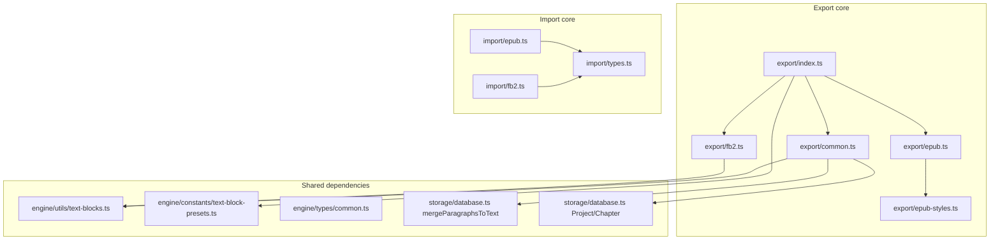

# Манифест переноса EPUB/FB2 export/import

Карта переноса для агента: скопировать модуль объединения глав в EPUB/FB2 (экспорт) и разбора EPUB/FB2 (импорт) в отдельную репозиторию.

**Источник:** [arcane-reader](https://github.com/arcane-reader) (этот репозиторий).

**Вне scope:** API-роуты (`server.ts`), Supabase Storage, UI, txt/csv-импорт.

---

## Публичный API

### Export

| Функция                             | Файл                                                                   | Описание                                               |
| ----------------------------------- | ---------------------------------------------------------------------- | ------------------------------------------------------ |
| `exportProject(project, options)`   | [`src/services/export/index.ts`](../../src/services/export/index.ts)   | Главная точка входа: `format: 'epub' \| 'fb2'`         |
| `prepareProjectForExport(...)`      | [`src/services/export/common.ts`](../../src/services/export/common.ts) | `Project` → `ExportProject` (фильтр переведённых глав) |
| `exportToEpub(exportData, options)` | [`src/services/export/epub.ts`](../../src/services/export/epub.ts)     | `ExportProject` → путь к `.epub`                       |
| `exportToFb2(exportData, options)`  | [`src/services/export/fb2.ts`](../../src/services/export/fb2.ts)       | `ExportProject` → путь к `.fb2`                        |

Типы: `ExportProject`, `ExportChapter`, `ExportFormat`, `ExportOptions` — в [`common.ts`](../../src/services/export/common.ts) и [`index.ts`](../../src/services/export/index.ts).

### Import

| Функция                     | Файл                                                               | Описание                              |
| --------------------------- | ------------------------------------------------------------------ | ------------------------------------- |
| `parseEpub(fileBuffer)`     | [`src/services/import/epub.ts`](../../src/services/import/epub.ts) | `Buffer` → `ParseResult`              |
| `parseEpubLazy(fileBuffer)` | [`src/services/import/epub.ts`](../../src/services/import/epub.ts) | Ленивый итератор глав (большие книги) |
| `parseFb2(fileBuffer)`      | [`src/services/import/fb2.ts`](../../src/services/import/fb2.ts)   | `Buffer` → `ParseResult`              |

Типы: `ParseResult`, `ParsedChapter`, `BookMetadata` — в [`src/services/import/types.ts`](../../src/services/import/types.ts).

---

## Архитектура



**Экспорт:** `Project` + главы → `prepareProjectForExport()` → `ExportProject` → `exportToEpub` / `exportToFb2` → файл на диске.

**Импорт:** `Buffer` → `parseEpub` / `parseFb2` → `ParseResult` (metadata + chapters[]).

---

## 1. Core export — копировать целиком

| Файл                                                                             | Роль                                                                                                  |
| -------------------------------------------------------------------------------- | ----------------------------------------------------------------------------------------------------- |
| [`src/services/export/index.ts`](../../src/services/export/index.ts)             | `exportProject`, `ExportFormat`, `ExportOptions`                                                      |
| [`src/services/export/common.ts`](../../src/services/export/common.ts)           | `ExportProject`, `prepareProjectForExport`, `textToHtml`, `textToHtmlWithBlocks`, `getTranslatedText` |
| [`src/services/export/epub.ts`](../../src/services/export/epub.ts)               | `exportToEpub` через `epub-gen-memory`                                                                |
| [`src/services/export/fb2.ts`](../../src/services/export/fb2.ts)                 | `exportToFb2`, генерация FictionBook XML                                                              |
| [`src/services/export/epub-styles.ts`](../../src/services/export/epub-styles.ts) | `EPUB_CSS` — стили text blocks для EPUB                                                               |

---

## 2. Core import (EPUB/FB2) — копировать целиком

| Файл                                                                 | Роль                                                           |
| -------------------------------------------------------------------- | -------------------------------------------------------------- |
| [`src/services/import/types.ts`](../../src/services/import/types.ts) | `ParseResult`, `ParsedChapter`, `BookMetadata`, `ImportFormat` |
| [`src/services/import/epub.ts`](../../src/services/import/epub.ts)   | `parseEpub`, `parseEpubLazy`, `ParseEpubLazyResult`            |
| [`src/services/import/fb2.ts`](../../src/services/import/fb2.ts)     | `parseFb2`                                                     |

**Не копировать** [`src/services/import/index.ts`](../../src/services/import/index.ts) целиком — он тянет txt/csv. В новой репе создать тонкий barrel:

```typescript
export { parseEpub, parseEpubLazy } from './epub.js';
export type { ParseEpubLazyResult } from './epub.js';
export { parseFb2 } from './fb2.js';
export type { ParseResult, ParsedChapter, BookMetadata } from './types.js';
```

---

## 3. Text blocks (маркеры `{{block:type-id}}`)

| Файл                                                                                             | Что используется                                                               |
| ------------------------------------------------------------------------------------------------ | ------------------------------------------------------------------------------ |
| [`src/engine/utils/text-blocks.ts`](../../src/engine/utils/text-blocks.ts)                       | `stripBlockMarkers`, `convertMarkersToHtml`, `mergeSegmentsWithUnclosedBlocks` |
| [`src/engine/constants/text-block-presets.ts`](../../src/engine/constants/text-block-presets.ts) | `DEFAULT_TEXT_BLOCK_TYPES`                                                     |
| [`src/engine/types/common.ts`](../../src/engine/types/common.ts)                                 | **Только** `TextBlockType`, `TextBlockHtmlTag` (строки 42–54)                  |

`validateBlockMarkers` и импорт `engine/logger` в export-пути не участвуют. При переносе можно удалить неиспользуемый код или заменить `log.warn` на no-op.

---

## 4. Arcane-типы — фрагменты, не весь файл

Из [`src/storage/database.ts`](../../src/storage/database.ts) (~1100 строк) нужны только:

| Символ                                    | Строки                                   | Зачем                                   |
| ----------------------------------------- | ---------------------------------------- | --------------------------------------- |
| `Project`                                 | 51–63                                    | Вход `exportProject`                    |
| `ParagraphStatus`                         | 84                                       | Тип параграфа                           |
| `Paragraph`                               | 87–95                                    | `mergeParagraphsToText`                 |
| `ChapterStatus`                           | 98–104                                   | Фильтр глав в `prepareProjectForExport` |
| `Chapter`                                 | 116–147                                  | Главы проекта                           |
| `ProjectSettings` (поле `textBlockTypes`) | 272–312 (`textBlockTypes` на строке 303) | Настройки text blocks                   |
| `mergeParagraphsToText`                   | 1009–1018                                | Склейка параграфов в текст главы        |

**Рекомендация:** в новой репе — `types/project.ts` с минимальными интерфейсами + `mergeParagraphsToText` (~50 строк). Не тянуть glossary, DB-функции, `GlossaryEntry`.

Минимальный контракт `ExportProject` (уже в export, без Arcane):

```typescript
interface ExportChapter {
  title: string;
  number: number;
  htmlContent: string; // для EPUB
  textContent: string; // для FB2 (может содержать {{block:...}})
}

interface ExportProject {
  title: string;
  author?: string;
  language: string;
  chapters: ExportChapter[];
  textBlockTypes?: TextBlockType[];
  metadata?: { translatedAt?: string; model?: string; totalChapters: number };
}
```

Для standalone-режима достаточно передавать `ExportProject` напрямую в `exportToEpub` / `exportToFb2`, без `prepareProjectForExport`.

---

## 5. Logger — заменить stub, не копировать

[`src/services/export/epub.ts`](../../src/services/export/epub.ts) и [`src/services/export/fb2.ts`](../../src/services/export/fb2.ts) импортируют [`src/logger.ts`](../../src/logger.ts) (pino + Axiom). В новой репе:

```typescript
// src/logger.ts
export const logger = {
  debug: (..._args: unknown[]) => {},
  info: (..._args: unknown[]) => {},
  error: (..._args: unknown[]) => {},
};
```

---

## 6. npm-зависимости

Из [`package.json`](../../package.json):

| Пакет             | Версия  | Назначение                                                      |
| ----------------- | ------- | --------------------------------------------------------------- |
| `epub-gen-memory` | ^1.1.2  | Генерация EPUB in-memory (Vercel-safe, без temp в node_modules) |
| `epub2`           | ^3.0.2  | Парсинг EPUB                                                    |
| `fast-xml-parser` | ^5.8.0  | FB2 XML + OPF в EPUB                                            |
| `adm-zip`         | ^0.5.17 | Fallback-разбор EPUB-архива                                     |
| `@types/adm-zip`  | ^0.5.8  | devDependency                                                   |

**Не нужны:** `epub-gen` (устарел, заменён на `epub-gen-memory`).

---

## 7. Справочные файлы (читать, не копировать)

| Файл                                                                                    | Зачем                                                          |
| --------------------------------------------------------------------------------------- | -------------------------------------------------------------- |
| [`docs/archive/EXPORT_E2E.md`](../archive/EXPORT_E2E.md)                                | EROFS на Vercel, почему `epub-gen-memory`, поток через `/tmp`  |
| [`scripts/diagnose-epub.ts`](../../scripts/diagnose-epub.ts)                            | CLI: `npx tsx scripts/diagnose-epub.ts path/to/file.epub`      |
| [`src/server.ts`](../../src/server.ts) строки 7152–7520                                 | Интеграция: tmpDir → `exportProject` → Supabase Storage upload |
| [`src/api/schemas/chapters.ts`](../../src/api/schemas/chapters.ts) строки 73–76         | `exportBodySchema`                                             |
| [`src/api/schemas/publications.ts`](../../src/api/schemas/publications.ts) строки 42–44 | `buildExportsBodySchema`                                       |

---

## 8. Явно НЕ включать

| Файл                                                                                 | Причина                                              |
| ------------------------------------------------------------------------------------ | ---------------------------------------------------- |
| [`src/services/import/txt.ts`](../../src/services/import/txt.ts)                     | Другой формат                                        |
| [`src/services/import/csv.ts`](../../src/services/import/csv.ts)                     | Другой формат                                        |
| [`src/services/import/project-type.ts`](../../src/services/import/project-type.ts)   | UI/Arcane `ProjectType`                              |
| [`src/services/export/epub-gen.d.ts`](../../src/services/export/epub-gen.d.ts)       | Устаревшие типы для `epub-gen`, не `epub-gen-memory` |
| [`src/client/api/client.ts`](../../src/client/api/client.ts)                         | Клиентский API                                       |
| [`src/client/pages/PublicationPage.tsx`](../../src/client/pages/PublicationPage.tsx) | UI публикаций                                        |

---

## Порядок копирования

1. [`src/services/import/types.ts`](../../src/services/import/types.ts)
2. [`src/services/import/epub.ts`](../../src/services/import/epub.ts), [`src/services/import/fb2.ts`](../../src/services/import/fb2.ts) → новый `import/index.ts`
3. Срез [`src/engine/types/common.ts`](../../src/engine/types/common.ts) (42–54) → `types/text-block.ts`
4. [`src/engine/constants/text-block-presets.ts`](../../src/engine/constants/text-block-presets.ts)
5. [`src/engine/utils/text-blocks.ts`](../../src/engine/utils/text-blocks.ts)
6. `types/project.ts` + `mergeParagraphsToText` из [`src/storage/database.ts`](../../src/storage/database.ts) (1009–1018)
7. [`src/services/export/common.ts`](../../src/services/export/common.ts), [`epub-styles.ts`](../../src/services/export/epub-styles.ts), [`epub.ts`](../../src/services/export/epub.ts), [`fb2.ts`](../../src/services/export/fb2.ts), [`index.ts`](../../src/services/export/index.ts)
8. `logger.ts` stub
9. `package.json` deps + `npm install`
10. Поправить import paths (`.js` суффиксы, относительные пути)

---

## Предлагаемая структура новой репы

```
packages/book-io/          # или корень standalone lib
  src/
    export/
      index.ts
      common.ts
      epub.ts
      fb2.ts
      epub-styles.ts
    import/
      index.ts
      types.ts
      epub.ts
      fb2.ts
    text-blocks/
      utils.ts          # from engine/utils/text-blocks.ts
      presets.ts        # from engine/constants/text-block-presets.ts
      types.ts          # TextBlockType slice
    types/
      project.ts        # minimal Project/Chapter/Paragraph + mergeParagraphsToText
    logger.ts
  package.json
  tsconfig.json
```

---

## Адаптация import paths после копирования

| Было (arcane-reader)                           | Стало (новая репа)                         |
| ---------------------------------------------- | ------------------------------------------ |
| `../../storage/database.js`                    | `./types/project.js` или `@/types/project` |
| `../../engine/utils/text-blocks.js`            | `./text-blocks/utils.js`                   |
| `../../engine/constants/text-block-presets.js` | `./text-blocks/presets.js`                 |
| `../../engine/types/common.js`                 | `./text-blocks/types.js`                   |
| `../../logger.js`                              | `./logger.js`                              |

---

## Чеклист после переноса

- [ ] Round-trip FB2: `parseFb2(buffer)` → собрать `ExportProject` → `exportToFb2` → валидный XML
- [ ] Round-trip EPUB: `parseEpub(buffer)` → `exportToEpub` → открывается в ридере
- [ ] Text blocks: глава с `{{block:system-message}}...{{/block:system-message}}` → EPUB (CSS `.system-message`) и FB2 (`<cite>`)
- [ ] EPUB генерируется в `Buffer` через `epub-gen-memory` (нет записи в `node_modules`)
- [ ] `parseEpubLazy` отдаёт главы по одной без загрузки всей книги в память
- [ ] `npm run typecheck` / `tsc --noEmit` проходит в новой репе

---

## Быстрый поиск по репозиторию

```bash
# Все файлы export/import EPUB-FB2
rg -l "exportToEpub|exportToFb2|parseEpub|parseFb2" src/

# Точка входа экспорта в API (только справка)
rg "exportProject" src/server.ts
```
