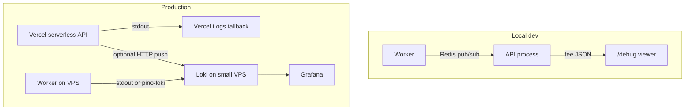

# Observability: Grafana Loki (future)

> **Archived 2026-06-06.** Superseded by [[../04-decisions/adr-observability-axiom]] — production logs ship to Axiom; local `/debug` unchanged. See [[../02-how-to/observability-axiom]].

**Trello board:** [Arcane Reader](https://trello.com/b/bJJpiDqs/arcane-reader) — epic cards in **ToDo** (#55–#64).

## Problem

Local `/debug` viewer (`src/debug/`) covers dev translation debugging (traces, export, worker merge via Redis). It is **disabled in production** and does not provide retention, cross-process search in prod, or alerts.

Production needs centralized logs with correlation by `requestId`, `traceId`, and `jobId` across API (Vercel) and worker (long-lived host).

## Current stack (ready for extension)

| Component       | Location                                        | Notes                           |
| --------------- | ----------------------------------------------- | ------------------------------- |
| Structured logs | `src/logger.ts`                                 | Pino, JSON stdout in prod       |
| Request scope   | `src/middleware/requestContext.ts`              | `requestId`, `req.log`          |
| Engine context  | `src/debug/context.ts`                          | `traceId`, `jobId`, `chapterId` |
| Dev UI          | `/debug`, `docs/02-how-to/debug-translation.md` | Ring buffer, not prod           |
| Worker bridge   | `src/debug/redisBridge.ts`                      | Dev-only Redis pub/sub          |
| Policy          | `.cursor/rules/logging.mdc`                     | English, no secrets             |

## Architecture (target)

## Vercel constraint

Cannot run Loki, Promtail, or Grafana on Vercel. Options (decide in ADR card):

1. **Short-term:** Vercel Logs only + `LOG_LEVEL=info`, filter JSON fields.
2. **Hybrid:** `pino.transport` — stdout + async push to Loki (`LOKI_URL`, feature-flag).
3. **Later:** move API to VPS — Alloy/Promtail reads container logs.

Worker already runs on a long-lived host (see `.cursor/rules/deployment.mdc`) — first Loki consumer.

## Phases and Trello cards

| Phase   | Card                                   | URL                           |
| ------- | -------------------------------------- | ----------------------------- |
| 0 ADR   | ADR: Observability — Loki, Vercel, VPS | https://trello.com/c/ACW4ZpfP |
| 1 Infra | Loki + Grafana на VPS (Compose)        | https://trello.com/c/xv6KAex1 |
| 2 App   | Pino → Loki transport (feature-flag)   | https://trello.com/c/PHInnYcT |
| 2 App   | Log labels service/env/version         | https://trello.com/c/EPnYsDnS |
| 2 App   | Worker: shipping логов в Loki          | https://trello.com/c/aX8YzYny |
| 2 App   | Vercel: стратегия логов API            | https://trello.com/c/z2nigsE2 |
| 3 Ops   | Grafana: дашборды Arcane               | https://trello.com/c/OTg28apr |
| 3 Ops   | Grafana: LogQL / runbook               | https://trello.com/c/FtDsJoVM |
| 3 Ops   | Alerts (опционально)                   | https://trello.com/c/vFODRXuO |
| 4 Docs  | logging.mdc + deployment + vault       | https://trello.com/c/0MinCBiB |

**Dependencies:** ADR → Infra → App (3–5) → Vercel strategy → Dashboards/runbook → Alerts/Docs.

## Label policy (Loki)

**Use as labels (low cardinality):** `service` (`api` | `worker`), `env`, `version`.

**Keep as JSON log fields (not labels):** `requestId`, `traceId`, `jobId`, `chapterId`, `projectId`, `userId`.

## Planned env vars (draft)

| Variable                          | Purpose                                  |
| --------------------------------- | ---------------------------------------- |
| `LOG_SHIPPING`                    | Enable remote log shipping (`1` / unset) |
| `LOKI_URL`                        | Loki push endpoint                       |
| `LOKI_USERNAME` / `LOKI_PASSWORD` | Auth (if required)                       |
| `LOG_LEVEL`                       | Already exists — keep `info` in prod     |

Document in `env.example.txt` and `.cursor/rules/deployment.mdc` when implemented.

## Out of scope (v1)

- Replacing `/debug` dev UI
- Client-side error reporting
- Full API migration off Vercel
- Prometheus metrics (separate epic)

## Risks (small VPS)

- Disk: limit retention (7–14 days), no `debug` level in prod.
- Cardinality: never label high-cardinality IDs.
- Secrets: audit before enabling push; `DEBUG_CAPTURE_LLM` stays dev-only.

## Completion checklist

- [ ] ADR decision recorded
- [ ] Loki + Grafana running on VPS
- [ ] Pino transport behind feature-flag
- [ ] Worker logs visible in Grafana
- [ ] Vercel strategy chosen and documented
- [ ] Dashboards + LogQL runbook
- [ ] Update `.cursor/rules/logging.mdc`, `deployment.mdc`, `env.example.txt`
- [ ] Set this plan `status: archived`; update [[project-status]]
