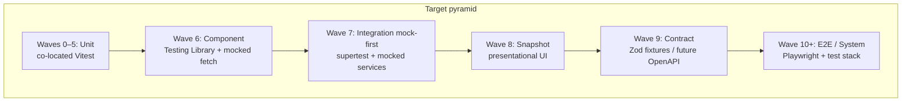

# Testing strategy (pyramid)

Global SSOT for **what** to test and **in which order**. Measured numbers live in [[05-plans/testing-baseline]]. Agent policy: [[_canonical/rules/testing]].

## Executive summary

Arcane Reader is a Preact SPA + Express API + Supabase + BullMQ worker. Waves 0–5 built a strong **unit** base (~65% lines). The pyramid next expands **component** and **mock-integration**, then snapshot/contract stubs, then live E2E when a dedicated test environment exists.



| Phase              | Scope                               | External I/O                                              |
| ------------------ | ----------------------------------- | --------------------------------------------------------- |
| **Q3** (Waves 6–7) | Unit + Component + mock-integration | Always mocked (Supabase, Redis, LLM, fetch)               |
| **Q4+** (Wave 10+) | Live integration + E2E              | Dedicated test stack only — never prod/staging as CI gate |

## APP_SCOPE

Coverage and mutation share one scope — see `vitest.config.ts` / `stryker.conf.json`. Lab apps (`debug-app`, `prompt-lab-app`, `debug/`, `prompt-lab/`) are excluded.

## Test types

| Type                   | Tooling                               | Location                        | When to write                                |
| ---------------------- | ------------------------------------- | ------------------------------- | -------------------------------------------- |
| **Unit**               | Vitest (`node`)                       | `src/**/*.test.ts` co-located   | Pure logic, Zod, handlers with mocks         |
| **Unit (DOM)**         | Vitest + `happy-dom` pragma           | co-located                      | Client utils needing `window`/`localStorage` |
| **Component**          | `@testing-library/preact` + happy-dom | `*.test.tsx`, `*.hook.test.ts`  | Hooks, gates, forms — mocked API             |
| **Integration (mock)** | Vitest + supertest                    | `tests/integration/**`          | Route → handler → mocked service chains      |
| **Integration (live)** | Vitest + real stack                   | `tests/integration/supabase/**` | **Blocked** — see README there               |
| **Snapshot**           | Vitest `toMatchSnapshot`              | co-located `__snapshots__/`     | Stable presentational UI only                |
| **Contract**           | Zod fixture round-trips               | `tests/contracts/**`            | API/shared shapes; OpenAPI later             |
| **E2E**                | Playwright (planned)                  | `tests/e2e/**`                  | Smoke flows on test env                      |
| **Mutation**           | Stryker                               | APP_SCOPE                       | Manual/nightly — not CI gate                 |

### Anti-patterns

- Live LLM / Supabase / Redis in unit or component tests
- Snapshot of `ReadingMode` or async pages
- E2E against prod/staging as a merge gate
- Pact broker before service split (Wave 9 phase 1 uses Zod fixtures only)

## Module map → priority

| Area                             | Unit        | Component       | Mock integration  | Notes                     |
| -------------------------------- | ----------- | --------------- | ----------------- | ------------------------- |
| `src/shared/`                    | High (done) | —               | Contract fixtures | Near ceiling              |
| `src/engine/`                    | High (done) | —               | Pipeline chains   | Mock LLM                  |
| `src/api/handlers`               | High (done) | —               | Wave 7 routes     | Already extracted         |
| `src/services/domains`           | High        | —               | Wave 7            | Mock client               |
| `src/services/jobs`              | Low         | —               | Wave 7 P0         | 0% today                  |
| `src/client/utils`               | High        | —               | —                 | Strong                    |
| `src/client/api`                 | High        | —               | Client suite      | Strong                    |
| `src/client/hooks`               | Medium      | **Wave 6 P0**   | —                 | Gap                       |
| `src/client/components`          | Low         | **Wave 6**      | —                 | Gap                       |
| `src/client/pages`               | —           | Wave 6 P3 smoke | —                 | Thin wrappers             |
| `createApp` / routes glue        | —           | —               | Wave 7            | Extracted for testability |
| `server.ts` listen / worker boot | Deferred    | —               | —                 | Bootstrap only            |

## Roadmap

### Wave 6 — Component (next rollout)

**Goal:** raise `client/` coverage; cover UI business logic without live API.

Infra: `vitest.component.config.ts`, `src/test/setup-component.ts`, `npm run test:component`.

| Priority | Targets                                                                                   |
| -------- | ----------------------------------------------------------------------------------------- |
| P0       | `useUserRole`, `useChapterTranslation`, `useBatchChapterTranslation`, `useReadingHistory` |
| P1       | `AuthorGate`, `AdminGate`, `SettingsModal`, ReadingFlow helpers                           |
| P2       | Publication filters, `ui/Button`/`Modal`/`Input` smoke                                    |
| P3       | `pages/*` render-without-crash                                                            |

### Wave 7 — Mock integration

**Goal:** chains (HTTP → handler → mocked service → JSON), not single functions.

Infra: `createApp()`, `vitest.integration.config.ts`, `supertest`, `npm run test:integration`.

| Suite            | Path                                        |
| ---------------- | ------------------------------------------- |
| API              | `tests/integration/api/*.test.ts`           |
| Client API layer | `tests/integration/client/*.test.ts`        |
| Worker jobs      | `tests/integration/worker/*.test.ts`        |
| Live Supabase    | `tests/integration/supabase/` — **blocked** |

### Wave 8 — Snapshot

After Wave 6–7 stabilize. Presentational only (`ui/*`, EntityCard). Review snapshot diffs in PR. No full pages.

### Wave 9 — Contract (monolith → future split)

Phase 1 (now): Zod schema + shared fixture JSON in `tests/contracts/`. Phase 2 (after split): OpenAPI / Pact.

### Wave 10+ — E2E (blocked)

#### Prerequisites

- [ ] Isolated Supabase project (seed fixtures, JWT users per role)
- [ ] Redis + BullMQ worker
- [ ] `.env.test` (not prod/staging)
- [ ] CI job (docker-compose or dedicated test stack)
- [ ] Playwright installed + `tests/e2e/` wired

#### Planned smoke flows

| Flow                  | Route sketch                   |
| --------------------- | ------------------------------ |
| Guest catalog         | `/` → filter → publication     |
| Auth login/logout     | modal → session                |
| Author create project | `/projects` → new              |
| Translate chapter     | chapter → translate → progress |
| Reader progress       | `/p/*/reading` → next chapter  |
| Admin entities        | `/admin/entities`              |

See [[tests/e2e/README|tests/e2e/README.md]] (repo path).

## Infrastructure

| Artifact                         | Role                                 |
| -------------------------------- | ------------------------------------ |
| `vitest.config.ts`               | Fast unit suite + coverage APP_SCOPE |
| `vitest.slow.config.ts`          | Tiktoken-heavy engine tests          |
| `vitest.component.config.ts`     | Component / hook DOM suite           |
| `vitest.integration.config.ts`   | Mock-integration suite               |
| `src/createApp.ts`               | Express app factory (no `listen`)    |
| `src/test/setup-component.ts`    | i18n + Testing Library cleanup       |
| `tests/integration/`             | Integration tests                    |
| `tests/contracts/`               | Contract stubs                       |
| `tests/e2e/`                     | E2E stubs (blocked)                  |
| `scripts/gen-test-inventory.mjs` | Inventory after coverage             |

### npm scripts

```bash
npm run test                 # unit (fast)
npm run test:slow            # tiktoken
npm run test:component       # Testing Library
npm run test:integration     # mock-integration
npm run test:contract        # contract suite (when tests exist)
npm run test:e2e             # placeholder until Playwright + test env
npm run test:all             # unit + slow + component + integration + contract
npm run test:coverage        # unit coverage
```

Pre-push today: `lint:all` + `test`. Expand gradually to include `test:component`, then `test:integration`.

## Metrics (orientation, not gates)

| Milestone     | Lines % | Component files | Integration files |
| ------------- | ------- | --------------- | ----------------- |
| Wave 5 (done) | ~65%    | 1               | 0                 |
| Wave 6        | ~70%    | ~30             | 0                 |
| Wave 7        | ~75%    | ~40             | ~15               |
| Wave 8–9      | ~78%    | +snapshots      | +contracts        |
| Wave 10+      | 80%+    | stable          | live + E2E smoke  |

Refresh numbers: `npm run test:coverage` → `node scripts/gen-test-inventory.mjs` → update [[05-plans/testing-baseline]].

## Related

- Baseline numbers: [[05-plans/testing-baseline]]
- How to run: [[02-how-to/run-tests]]
- Patterns: `.cursor/skills/testing/PATTERNS.md`
- Policy: `.cursor/rules/testing.mdc`
