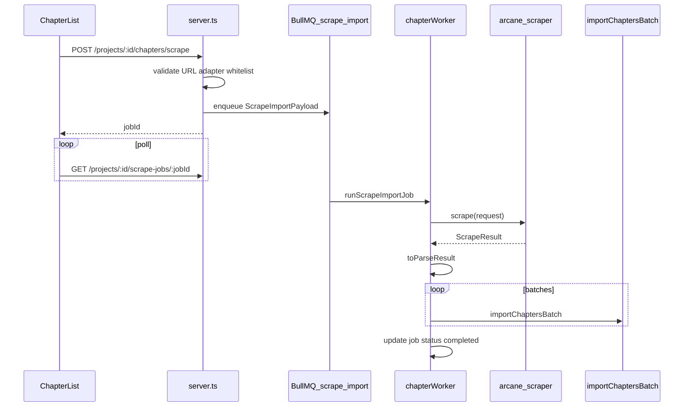

# Web Scraper Module — Research & MVP Foundation

Research document for an independent web parsing module to collect novels and light novels for translation in Arcane Reader. Covers industry approaches, live site spikes (EN / CN / JP), architecture for the monorepo, integration with the existing import pipeline, legal constraints, and phased MVP.

> **Archived.** Phase 2–3 reader integration was implemented then **rolled back** in favor of a standalone dev app. See **Current state (2026)** and **Phase 3.5** below. Phase 4 (re-import into projects) remains future work.

## Current state (2026)

| Component                  | Location                                                                    | How to run                                                    |
| -------------------------- | --------------------------------------------------------------------------- | ------------------------------------------------------------- |
| `@arcane/scraper` library  | [arcane-scraper](https://github.com/arcane-scraper) `packages/scraper/`     | `npm run test`, `npm run build:scraper` in that repo          |
| Scraper console (UI + API) | [arcane-scraper](https://github.com/arcane-scraper) `apps/scraper-console/` | `npm run dev` in that repo → `http://localhost:PORT/scraper/` |
| arcane-reader              | No scraper dependency                                                       | File import only (`epub`, `fb2`, `csv`)                       |

**Related code (current):** external repo [arcane-scraper](https://github.com/arcane-scraper) — migrated from Arcane monorepo on 2026-06-10.

**Removed from arcane-reader:** `POST …/chapters/scrape`, `runScrapeImportJob`, scrape worker queue, debug Scraper tab, `@arcane/scraper` dependency.

---

## 1. Executive summary

### Recommended stack

| Layer             | Choice                                         | Rationale                                                                    |
| ----------------- | ---------------------------------------------- | ---------------------------------------------------------------------------- |
| Language          | **TypeScript (Node.js 18+)**                   | Matches Arcane Reader; Crawlee and Playwright have first-class TS support    |
| Crawl framework   | **Crawlee 3.x**                                | Request queue, retries, sessions, Cheerio + Playwright under one API         |
| Extraction        | **Site-specific adapters + Cheerio**           | Novel sites use repeated chapter containers, not article-shaped HTML         |
| Generic fallback  | **@mozilla/readability** (optional)            | Only for unknown single-page content, not TOC crawl                          |
| Long-running jobs | **BullMQ worker** (new `chapter-scrape` queue) | File import uses in-process `setImmediate`; scrape needs worker + Playwright |
| Module location   | **`packages/scraper`** (`@arcane/scraper`)     | Clear boundary; npm workspaces in root `package.json`                        |
| First adapter     | **Royal Road**                                 | Static HTML, stable selectors, no login for public fiction                   |
| Second adapter    | **syosetu (ncode)**                            | Static HTML, predictable URL pattern, UTF-8 Japanese                         |
| Docker            | **Yes** — `mcr.microsoft.com/playwright` image | Required when PlaywrightCrawler is enabled (Phase 2+)                        |

### MVP phases (high level)

| Phase | Scope                                                                     | Duration (est.) |
| ----- | ------------------------------------------------------------------------- | --------------- |
| **0** | This research doc + live spikes                                           | Done            |
| **1** | `packages/scraper`, Crawlee CheerioCrawler, Royal Road adapter, CLI       | 2–3 weeks       |
| **2** | PlaywrightCrawler in Docker, syosetu adapter, BullMQ `scrape-import` job  | 2 weeks         |
| **3** | API `POST .../chapters/scrape`, UI URL input, env flags, legal disclaimer | 1–2 weeks       |

### Key risks

1. **Legal / ToS** — scraping may violate platform terms; MVP uses **whitelisted adapters only**, not arbitrary URLs.
2. **Anti-bot (CN)** — Qidian, Webnovel, NovelUpdates returned 403/404 in spikes; MTL aggregators vary (fanmtl OK via HTTP; mtlnovel.com SSL failure).
3. **Vercel timeout** — scrape must run in worker, not API serverless handler.
4. **Markup drift** — adapters need versioning and fixture-based tests.
5. **Monorepo** — one-time npm workspaces setup.

---

## 2. Problem statement

### What we collect

```
Novel URL (TOC)
    → metadata (title, author, description, cover)
    → chapter list (title, order, URL)
    → per-chapter fetch
    → HTML → plain text (paragraphs)
    → ParseResult
    → importChaptersBatch → Supabase
```

### Difference from file import

| Aspect             | File import (`epub`, `fb2`, `txt`, `csv`) | Web scrape                          |
| ------------------ | ----------------------------------------- | ----------------------------------- |
| Input              | Multipart upload                          | URL + adapter id                    |
| Parser             | Format-specific (`parseEpub`, etc.)       | HTTP fetch + site adapter           |
| Chapter boundaries | Spine, FB2 sections, CSV rows             | TOC table + pagination              |
| Job runtime        | `setImmediate` in API process             | Minutes; needs BullMQ + worker      |
| Dependencies       | `epub2`, `fast-xml-parser`, `csv-parse`   | `crawlee`, `cheerio`, `playwright`  |
| Legal              | User owns file                            | User must have rights to source URL |

Current import contract ([`src/services/import/types.ts`](../../src/services/import/types.ts)):

- `ParsedChapter.content` — **plain text** written to DB as `originalText`
- `BookMetadata` — title, authors, cover, description
- `ImportFormat` — today: `'txt' | 'epub' | 'fb2' | 'csv'`; extend with `'web'`

---

## 3. Industry landscape

### 3.1 Fetch / crawl layer

| Approach    | Stack                      | Best for                   | Pros                                                | Cons                         |
| ----------- | -------------------------- | -------------------------- | --------------------------------------------------- | ---------------------------- |
| HTTP-only   | `undici` / `got` + Cheerio | Static HTML (RR, syosetu)  | Fast, cheap, Node-native                            | No SPA, no Cloudflare bypass |
| **Crawlee** | Node/TS (Apify)            | Production crawls          | Queue, retry, proxy, sessions, Cheerio + Playwright | Learning curve               |
| Playwright  | Node/Python                | JS-rendered, login, scroll | Multi-browser, network intercept                    | Heavy; Docker required       |
| Puppeteer   | Node                       | Same as Playwright         | Mature                                              | Chromium-centric             |
| Scrapy      | Python                     | Large-scale pipelines      | Very mature middleware                              | Second language in monorepo  |
| Colly       | Go                         | High throughput            | Performance                                         | Separate service             |

**Recommendation:** Crawlee as the default; switch crawler type per adapter (`CheerioCrawler` vs `PlaywrightCrawler`).

### 3.2 Content extraction layer

| Tool                       | Runtime             | F1 (benchmarks) | Notes                                             |
| -------------------------- | ------------------- | --------------- | ------------------------------------------------- |
| @mozilla/readability       | Node (+ jsdom)      | ~0.94 median    | English-tuned; reader-mode                        |
| Trafilatura                | Python              | ~0.94–0.96 mean | Multilingual, metadata, markdown; fallback chain  |
| Crawl4AI                   | Python + Playwright | LLM-oriented    | Self-hosted markdown; good for RAG, not novel TOC |
| **Cheerio + selectors**    | Node                | Per-adapter     | **Industry standard for web novels**              |
| Jina Reader (`r.jina.ai/`) | SaaS                | N/A             | Single URL → markdown; spike only                 |
| Firecrawl                  | SaaS API            | N/A             | Full crawl + markdown; ~$9+/1000 pages at scale   |

**Critical insight:** Generic article extractors assume one main content block per page. Web novels have:

- A **TOC page** with hundreds of links
- **Identical layout** on every chapter page (`#chapter-content`, `.p-novel__body`)
- **Next-chapter** navigation instead of infinite scroll

Therefore: **site adapters**, not Readability-first.

### 3.3 Managed / SaaS (when to use)

| Service                   | Use in Arcane                   | Avoid for                               |
| ------------------------- | ------------------------------- | --------------------------------------- |
| Jina Reader               | Quick selector validation spike | Production user URLs (privacy, no TOC)  |
| Firecrawl                 | POC on messy pages              | Default pipeline (cost, 3rd-party data) |
| Apify Actors              | Reference implementations       | Vendor lock-in                          |
| ScrapingBee / Bright Data | CN anti-bot (Phase 4+)          | Extraction logic                        |

### 3.4 Infrastructure patterns

- **Docker:** Playwright official image for worker host
- **Job queue:** BullMQ — same pattern as `chapter-analysis` / `chapter-translate` in [`src/services/chapterWorker.ts`](../../src/services/chapterWorker.ts)
- **Intermediate cache:** Redis or filesystem for fetched chapter HTML (resume after crash)
- **Rate limiting:** Per-domain token bucket; default 1–2 req/s (syosetu `Crawl-delay: 1`)
- **robots.txt:** `robots-parser` before crawl
- **Observability:** `traceId` / `jobId` via existing Pino → Axiom pipeline

---

## 4. Novel-specific open-source ecosystem

Study patterns; do **not** fork without license review.

| Project                                                             | Language | Scale          | Patterns to borrow                                      |
| ------------------------------------------------------------------- | -------- | -------------- | ------------------------------------------------------- |
| [lightnovel-crawler](https://github.com/lncrawl/lightnovel-crawler) | Python   | 400+ sites     | Crawler registry, per-site anti-bot flags               |
| [Novel-Grabber](https://github.com/Flameish/Novel-Grabber)          | Java     | 100+ sites     | **Manual mode** — auto-detect chapter container         |
| [wn-dl](https://github.com/wongpinter/webnovel-scraper)             | Python   | Multi-provider | Provider plugins, EPUB pipeline, chapter DB cache       |
| [kazeboy/light-novel](https://github.com/kazeboy/light-novel)       | Python   | JP-focused     | Playwright for protected sites; metadata fallback chain |

**Shared patterns:**

1. `canHandle(url)` → pick adapter
2. `fetchMetadata()` → title, author, cover
3. `fetchChapterList()` → ordered `{ title, url, number }[]`
4. `fetchChapter(url)` → `{ title, content }`
5. HTML tag blacklist (`script`, `nav`, ads)
6. Cookie/session for gated content
7. Chapter range: `1-50`, `12-last`
8. Incremental cache — skip already-downloaded chapters

---

## 5. Regional source analysis & live spikes

Spike date: **2026-06-08**. Method: `curl.exe` with browser User-Agent (no JavaScript execution). Confirms whether **CheerioCrawler** is sufficient without Playwright.

### 5.1 Spike summary table

| Site                 | URL tested                                  | HTTP | Size   | JS required?   | Anti-bot                     | Notes                                       |
| -------------------- | ------------------------------------------- | ---- | ------ | -------------- | ---------------------------- | ------------------------------------------- |
| Royal Road (TOC)     | `/fiction/21220/mother-of-learning`         | 200  | 244 KB | **No**         | Blocks AI bots in robots.txt | Full chapter table in HTML                  |
| Royal Road (chapter) | `.../chapter/301778/1-good-morning-brother` | 200  | 80 KB  | **No**         | Same                         | Content in `.chapter-inner.chapter-content` |
| syosetu (TOC)        | `ncode.syosetu.com/n2267be/`                | 200  | 87 KB  | **No**         | `Crawl-delay: 1`             | Paginated TOC `?p=2`…`?p=8`                 |
| syosetu (chapter)    | `ncode.syosetu.com/n2267be/1/`              | 200  | 38 KB  | **No**         | Crawl-delay                  | `.p-novel__text` inside `.p-novel__body`    |
| ScribbleHub (series) | `/series/467238/...`                        | 200  | 67 KB  | **No**         | Unknown                      | Series page, not chapter read               |
| ScribbleHub (read)   | `/read/467232-.../chapter/467238/`          | 200  | 66 KB  | **No**         | Unknown                      | `#chp_raw` content container                |
| fanmtl.com (chapter) | `/novel/the-legendary-mechanic_1.html`      | 200  | 29 KB  | **No**         | Low                          | `.chapter-content`; inline ad `<script>`    |
| mtlnovel.com         | chapter URL                                 | —    | 0      | —              | SSL error (curl 35)          | Unreliable from test env                    |
| novelfull.net        | chapter URL                                 | 404  | 14 KB  | —              | —                            | URL pattern changed or blocked              |
| novelupdates.com     | series page                                 | 403  | 6 KB   | Likely         | **Cloudflare/WAF**           | Not suitable for HTTP-only MVP              |
| webnovel.com         | book URL                                    | 404  | 27 KB  | Likely **Yes** | Commercial                   | SPA; login for full text                    |

### 5.2 EN — Royal Road (MVP adapter #1)

**URL patterns:**

- Fiction TOC: `https://www.royalroad.com/fiction/{id}/{slug}`
- Chapter: `https://www.royalroad.com/fiction/{id}/{slug}/chapter/{chapterId}/{slug}`

**Selectors (verified in spike):**

| Field         | Selector                                                  |
| ------------- | --------------------------------------------------------- |
| Title         | `h1.font-white` (fiction page)                            |
| Author        | `meta[property="books:author"]` or `a[href^="/profile/"]` |
| Description   | `meta[name="description"]`, JSON-LD `Book`                |
| Chapter rows  | `tr.chapter-row` with `data-url`                          |
| Chapter title | `tr.chapter-row a` text                                   |
| Chapter body  | `.chapter-inner.chapter-content`                          |
| Next chapter  | `.nav-buttons a` containing "Next"                        |

**robots.txt:** Disallows AI crawlers (GPTBot, ClaudeBot, etc.); general `User-agent: *` allows fiction/chapter pages with minimal disallows.

**Crawler:** `CheerioCrawler` — full HTML without JS.

### 5.3 EN — ScribbleHub (Phase 1 alternate)

**URL patterns:**

- Series: `https://www.scribblehub.com/series/{id}/{slug}/`
- Read: `https://www.scribblehub.com/read/{seriesId}-{slug}/chapter/{chapterId}/`

**Selectors:**

| Field        | Selector         |
| ------------ | ---------------- |
| Chapter body | `#chp_raw`       |
| Next         | `a.btn-next`     |
| Title        | `.chapter-title` |

**Crawler:** `CheerioCrawler`.

### 5.4 JP — syosetu (MVP adapter #2)

**URL patterns:**

- TOC: `https://ncode.syosetu.com/{ncode}/` (paginated `?p=N`)
- Chapter: `https://ncode.syosetu.com/{ncode}/{chapterNum}/`

**Selectors:**

| Field          | Selector                          |
| -------------- | --------------------------------- |
| Chapter links  | `a.p-eplist__subtitle`            |
| Volume headers | `.p-eplist__chapter-title`        |
| Chapter title  | `h1.p-novel__title`               |
| Body           | `.js-novel-text.p-novel__text`    |
| Progress       | `.p-novel__number` (e.g. `1/782`) |

**robots.txt:** `Crawl-delay: 1` for all agents; respect 1 req/s minimum.

**Encoding:** UTF-8; no special handling beyond standard Node strings.

**Crawler:** `CheerioCrawler`; paginate TOC across `?p=` pages.

### 5.5 CN — aggregators (Phase 2+, not MVP)

**fanmtl.com** (spike success):

| Field       | Selector                          |
| ----------- | --------------------------------- |
| Body        | `.chapter-content`                |
| Next        | `a.nextchap`, `a.chnav.next`      |
| URL pattern | `/novel/{slug}_{chapterNum}.html` |

**Challenges:**

- Original platforms (Qidian, Webnovel) use heavy JS + login + strict ToS
- Aggregator domains change frequently; adapters need maintenance
- Ad injection (`<script src=/d/js/ad/...>`) — strip in sanitizer
- NovelUpdates / similar metadata sites: 403 without browser fingerprint

**Crawler:** Start HTTP-only on fanmtl-like sites; escalate to Playwright + proxy only when needed.

---

## 6. Architecture for monorepo

### 6.1 Placement options

| Option              | Path                    | Pros                                | Cons                         |
| ------------------- | ----------------------- | ----------------------------------- | ---------------------------- |
| **A (recommended)** | `packages/scraper/`     | Independent package, CLI, clear API | Requires npm workspaces      |
| B                   | `src/services/scraper/` | Faster integration                  | Blurred boundary with server |

### 6.2 Package layout

```
packages/scraper/
  package.json          # name: @arcane/scraper
  tsconfig.json
  Dockerfile            # Playwright base image
  src/
    index.ts            # public API
    types/
      scrape.ts         # ScrapeRequest, ScrapeResult, SourceAdapter
    core/
      engine.ts         # Crawlee wrapper
      rate-limiter.ts
      robots.ts         # robots-parser integration
      sanitize.ts       # HTML → plain text, tag blacklist
    adapters/
      registry.ts
      royalroad.ts
      syosetu.ts
      scribblehub.ts
      generic-manual.ts # Novel-Grabber-style container detection
    map/
      to-parse-result.ts
    cli/
      scrape.ts         # npx arcane-scrape <url>
  fixtures/             # saved HTML for unit tests (no live crawl in CI)
```

### 6.3 SourceAdapter interface

```typescript
/** Identifies and scrapes one site family. */
export interface SourceAdapter {
  readonly id: string; // e.g. 'royalroad', 'syosetu'
  readonly displayName: string;
  readonly domains: string[]; // ['www.royalroad.com']

  canHandle(url: string): boolean;

  fetchMetadata(ctx: AdapterContext, tocUrl: string): Promise<ScrapedMetadata>;

  fetchChapterList(
    ctx: AdapterContext,
    tocUrl: string,
    options?: ChapterListOptions
  ): Promise<ScrapedChapterRef[]>;

  fetchChapter(ctx: AdapterContext, chapterRef: ScrapedChapterRef): Promise<ScrapedChapter>;
}

export interface AdapterContext {
  fetchHtml(url: string): Promise<string>;
  log: Logger;
  signal?: AbortSignal;
}

export interface ScrapedMetadata {
  title: string;
  authors?: string[];
  description?: string;
  coverUrl?: string;
  language?: string;
  sourceUrl: string;
}

export interface ScrapedChapterRef {
  number: number;
  title: string;
  url: string;
}

export interface ScrapedChapter {
  number: number;
  title: string;
  content: string; // plain text
  htmlContent?: string; // optional, for future export parity
  sourceUrl: string;
}

export interface ScrapeRequest {
  url: string;
  adapterId?: string; // auto-detect if omitted
  chapterRange?: string; // e.g. '1-20', '5-last'
  respectRobots?: boolean; // default true
}

export interface ScrapeResult {
  adapterId: string;
  metadata: ScrapedMetadata;
  chapters: ScrapedChapter[];
  warnings: string[];
  errors: string[];
}
```

### 6.4 Mapping ScrapeResult → ParseResult

```typescript
import type { ParseResult, ParsedChapter, BookMetadata } from '@arcane/import-types';
// Shared types: move ImportFormat + ParseResult to packages/shared or re-export from scraper consumer

export function toParseResult(scrape: ScrapeResult): ParseResult {
  const metadata: BookMetadata = {
    title: scrape.metadata.title,
    authors: scrape.metadata.authors,
    description: scrape.metadata.description,
    language: scrape.metadata.language,
    // coverImage: fetched separately if coverUrl set
  };

  const chapters: ParsedChapter[] = scrape.chapters.map((ch) => ({
    number: ch.number,
    title: ch.title,
    content: ch.content,
    htmlContent: ch.htmlContent,
  }));

  return {
    format: 'web',
    metadata,
    chapters,
    warnings: scrape.warnings,
    errors: scrape.errors.length ? scrape.errors : undefined,
  };
}
```

**Cover image:** optional second step — `fetch(coverUrl)` → `BookMetadata.coverImage` buffer (same as EPUB import in server).

**HTML → plain text:** reuse approach from [`src/services/import/epub.ts`](../../src/services/import/epub.ts) (`htmlToPlainText`) or dedicated sanitizer with tag blacklist:

`script, style, nav, iframe, ins, .ads, [class*="ad-"]`

---

## 7. Integration with Arcane Reader

### 7.1 Sequence diagram



### 7.2 API (proposed)

| Method | Path                                          | Body                                 | Notes                               |
| ------ | --------------------------------------------- | ------------------------------------ | ----------------------------------- |
| `POST` | `/api/projects/:id/chapters/scrape`           | `{ url, adapterId?, chapterRange? }` | Returns `{ jobId }`                 |
| `GET`  | `/api/projects/:id/scrape-jobs/:jobId`        | —                                    | Progress, same shape as import jobs |
| `POST` | `/api/projects/:id/scrape-jobs/:jobId/cancel` | —                                    | Abort signal to worker              |

Zod schema in `src/api/schemas/` per API skill.

### 7.3 BullMQ extension

Add to [`src/services/chapterQueue.ts`](../../src/services/chapterQueue.ts):

```typescript
export interface ScrapeImportJobPayload {
  jobId: string;
  projectId: string;
  userId: string;
  url: string;
  adapterId?: string;
  chapterRange?: string;
}
```

New queue: `chapter-scrape-import`. Register worker in [`src/services/chapterWorker.ts`](../../src/services/chapterWorker.ts) with:

- `lockDuration`: 60+ minutes (large novels)
- `concurrency`: 1–2 (rate-limit friendly)

Job state: extend [`importJobStore.ts`](../../src/services/importJobStore.ts) **or** create `scrapeJobStore` with `format: 'web'`.

**Why not `setImmediate`:** file import in [`server.ts`](../../src/server.ts) runs in API process; scrape of 100+ chapters exceeds Vercel/serverless limits and needs Playwright in worker container.

### 7.4 Reuse existing import path

[`importChaptersBatch`](../../src/services/supabaseDatabase.ts) accepts:

```typescript
{
  title: string;
  originalText: string;
}
[];
```

No change required for DB layer. After scrape:

1. `invalidateProjectAndRelatedCaches(userId, projectId, token)`
2. Auto-set `project.type` via `getProjectTypeFromFormat('web')` → likely `'text'` or new `'web'`
3. Merge metadata if first import (mirror EPUB flow in server)

### 7.5 Environment variables (proposed)

| Variable                  | Default | Purpose                               |
| ------------------------- | ------- | ------------------------------------- |
| `SCRAPER_ENABLED`         | `false` | Feature flag                          |
| `SCRAPER_MAX_CHAPTERS`    | `500`   | Cap per job                           |
| `SCRAPER_RATE_LIMIT_MS`   | `1000`  | Min delay between requests per domain |
| `SCRAPER_RESPECT_ROBOTS`  | `true`  | robots.txt gate                       |
| `BULL_SCRAPE_CONCURRENCY` | `1`     | Worker concurrency                    |

Add to `env.example.txt` and `.cursor/rules/deployment.mdc` when implemented.

### 7.6 UI (Phase 3)

Extend [`ChapterList.tsx`](../../src/client/components/Sidebar/ChapterList.tsx):

- "Import from URL" modal
- Adapter dropdown (auto-detected + override)
- Chapter range input
- Poll `scrape-jobs/:jobId` (reuse import job UI patterns)
- **Legal disclaimer** checkbox before submit

---

## 8. Legal & compliance

> **Not legal advice.** Product and legal review required before public launch.

### 8.1 Technical vs legal permission

Scraping may be **technically feasible** while **legally restricted** by copyright, Terms of Service, or contract law (varies by jurisdiction).

### 8.2 Platform policies (examples)

| Platform                   | Typical restriction                                   |
| -------------------------- | ----------------------------------------------------- |
| Webnovel / Qidian          | ToS prohibit automated access; login-gated content    |
| Royal Road                 | Public reading allowed; AI bots blocked in robots.txt |
| syosetu                    | Crawl-delay required; commercial reuse restricted     |
| Aggregators (fanmtl, etc.) | No official license; unstable domains                 |

### 8.3 Product recommendations

1. **Whitelist adapters only** in MVP — no arbitrary URL field
2. **User disclaimer:** user confirms they have right to import and translate
3. **robots.txt** compliance by default (`SCRAPER_RESPECT_ROBOTS=true`)
4. **Rate limits** — syosetu `Crawl-delay: 1`; default 1 req/s globally
5. **No redistribution** — scraped text stays in user's private project
6. **Opt-in feature flag** — `SCRAPER_ENABLED` off by default in production until review
7. **Do not scrape** paywalled / login-only content in MVP

### 8.4 robots.txt snapshot (spike)

**Royal Road:** blocks GPTBot, ClaudeBot, etc.; general crawling of fiction/chapters not disallowed.

**syosetu:** `Crawl-delay: 1` for `User-agent: *`; BingBot `Crawl-delay: 3`.

---

## 9. MVP proposal

### Phase 0 — Research (complete)

- [x] This document
- [x] Live spikes: Royal Road, syosetu, ScribbleHub, fanmtl
- [x] Adapter interface design
- [x] Integration sketch

### Phase 1 — Core + Royal Road (2–3 weeks) — **complete**

**Deliverables:**

- [x] `packages/scraper` (`@arcane/scraper`, `npm run scrape --prefix packages/scraper`)
- [x] HTTP engine via `got-scraping` + rate limit + robots.txt (Crawlee integration deferred to Phase 2)
- [x] `royalroad` adapter (metadata, TOC, chapters)
- [x] `toParseResult()` mapper
- [x] CLI: `npm run scrape -- <url> [--chapters 1-10]`
- [x] Unit tests on `fixtures/royalroad/*.html`

**Done when:**

- [x] Fixture tests export valid `ParseResult` for chapters 1–5 (no network)
- [x] `npm run test:scraper` passes
- [x] `npm run typecheck` includes scraper package
- [x] Live CLI smoke on Royal Road (Mother of Learning ch.1)

### Phase 2 — Worker + syosetu (2 weeks) — **superseded / rolled back**

Implemented temporarily, then removed from arcane-reader when scraper moved to standalone console.

**Was delivered (historical):**

- [x] `syosetu` adapter with TOC pagination (retained in `@arcane/scraper`)
- [x] BullMQ `chapter-scrape-import` + `runScrapeImportJob` — **removed** from reader
- [ ] Docker Compose + Playwright — not done

### Phase 3 — Platform integration (1–2 weeks) — **superseded / rolled back**

Reader UI/API/worker scrape path was built then **removed**. Not the current architecture.

**Was delivered (historical):**

- [x] API `POST …/chapters/scrape`, UI modal, `SCRAPER_ENABLED` — **removed**
- [x] Debug console scraper tab — **removed** (replaced by Phase 3.5)

### Phase 3.5 — Standalone console (complete)

**Deliverables:**

- [x] Monorepo workspaces: `packages/scraper`, `apps/scraper-console`
- [x] `@arcane/scraper-console`: Express + Vite middleware, `/api/scraper/*`, UI at `/scraper/`
- [x] Stage logging (`onStage`), run history ring buffer
- [x] Purge arcane-reader: no `@arcane/scraper` dep, no scrape worker/queue, no debug tab
- [x] Docs: `routing.mdc`, `debug.mdc`, `local-dev/SKILL.md`, `apps/scraper-console/README.md`

**Done when:**

- [x] `npm run dev:scraper` → scrape RR/syosetu with stage timeline (no Redis)
- [x] `rg scraper arcane-reader/src` → 0 matches
- [x] `npm run test:scraper` passes

### Out of scope (MVP)

- CN Qidian / Webnovel originals
- Login / cookie UI
- Proxy rotation
- Incremental sync (new chapters only)
- LLM-based extraction (Firecrawl / Crawl4AI)
- Arbitrary URL / generic manual mode (Phase 4)
- Public catalog scraping

---

## 10. Cost model (rough)

Assumptions: 500 chapters × 2 requests (TOC amortized) ≈ 1000 HTTP fetches per novel.

| Approach                               | 1 novel (~1k pages) | 10 novels/month         | Notes                   |
| -------------------------------------- | ------------------- | ----------------------- | ----------------------- |
| Self-hosted Crawlee + Cheerio          | ~$0 marginal        | ~$0                     | Worker CPU only         |
| Self-hosted + Playwright               | ~$5–20/mo worker    | Scales with concurrency | Railway/Fly 2GB RAM     |
| Firecrawl (~9 credits/page structured) | ~$45+               | ~$450+                  | Not recommended default |
| Jina Reader                            | ~$2–10              | ~$20–100                | Per-page API pricing    |
| Residential proxy (CN)                 | $50–300/mo          | Required for some CN    | Phase 4+                |

**Recommendation:** self-hosted Crawlee; SaaS only for one-off spikes.

---

## 11. Open questions & Phase 4+

| Topic                    | Question                              | Default stance                                       |
| ------------------------ | ------------------------------------- | ---------------------------------------------------- |
| Shared types package     | `ParseResult` in `packages/shared`?   | Re-export from server import types initially         |
| Manual / generic adapter | Novel-Grabber-style container detect? | Phase 4; high maintenance                            |
| Python sidecar           | Trafilatura for messy pages?          | Only if CN/JP extraction quality insufficient        |
| Incremental import       | Re-scrape for new chapters?           | Store `sourceUrl` on chapter metadata (DB migration) |
| kakuyomu                 | Playwright required?                  | Spike before adapter                                 |
| RU fan sites             | Priority?                             | After EN/JP adapters stable                          |
| Cover images             | Always fetch?                         | Optional; mirror EPUB cover upload                   |

---

## 12. References

### Frameworks & libraries

- [Crawlee](https://github.com/apify/crawlee) — Node crawl framework
- [Playwright](https://playwright.dev/) — browser automation
- [@mozilla/readability](https://github.com/mozilla/readability)
- [Trafilatura](https://github.com/adbar/trafilatura) — Python extraction benchmarks
- [Crawl4AI](https://github.com/unclecode/crawl4ai) — LLM-oriented self-hosted
- [robots-parser](https://www.npmjs.com/package/robots-parser) — robots.txt

### Comparisons & guides

- [Readability vs Trafilatura benchmark (2026)](https://bulkmd.app/blog/readability-vs-trafilatura-extractors)
- [Crawlee parsing guide](https://www.coronium.io/blog/crawlee-parsing-guide)
- [Firecrawl vs Crawl4AI](https://alterlab.io/blog/firecrawl-vs-crawl4ai-web-scraping-for-rag)

### Novel tooling

- [lightnovel-crawler](https://github.com/lncrawl/lightnovel-crawler)
- [Novel-Grabber](https://github.com/Flameish/Novel-Grabber)
- [wn-dl / webnovel-scraper](https://github.com/wongpinter/webnovel-scraper)

### arcane-scraper repo (current)

- Repo: [arcane-scraper](https://github.com/arcane-scraper)
- Library: `packages/scraper/` (`@arcane/scraper`)
- Console app: `apps/scraper-console/` (`src/server.ts`, `src/routes.ts`, `ui/App.tsx`)
- Root scripts: `npm run dev`, `npm run test`, `npm run build`

### Arcane Reader code (file import only)

- Import types: `src/services/import/types.ts`
- File import router: `src/services/import/index.ts`
- Import jobs: `src/server.ts` (`importJobStore`)
- Batch persist: `src/services/supabaseDatabase.ts` → `importChaptersBatch`

---

## Appendix A — Technology decision record

| Decision         | Choice                             | Alternative rejected                             |
| ---------------- | ---------------------------------- | ------------------------------------------------ |
| Primary language | TypeScript / Node                  | Python Scrapy sidecar                            |
| Crawl framework  | Crawlee                            | DIY Playwright + queue                           |
| Extraction       | Site adapters + Cheerio            | Readability-first                                |
| Job runtime      | Sync in scraper-console (dev)      | BullMQ worker in reader (**rolled back**)        |
| Module path      | `packages/scraper` (monorepo root) | `src/services/scraper/`                          |
| Dev UI           | `apps/scraper-console` standalone  | Reader ChapterList / debug tab (**rolled back**) |
| MVP adapter #1   | Royal Road                         | ScribbleHub (similar; second)                    |
| MVP adapter #2   | syosetu                            | kakuyomu (likely needs Playwright)               |
| SaaS             | Spike only                         | Firecrawl as default                             |
